# OpenDleto
Dleto, which means chisel, is a package of tools to carve information out of tensor data. This is an early release simplified implementation of a larger project of research methods developed in multiple languages.  Visit  [TheTensor.Space](https://TheTensor.Space/) for the main project.

<!-- <div class="slideshow-container"> -->
<table >
<th>
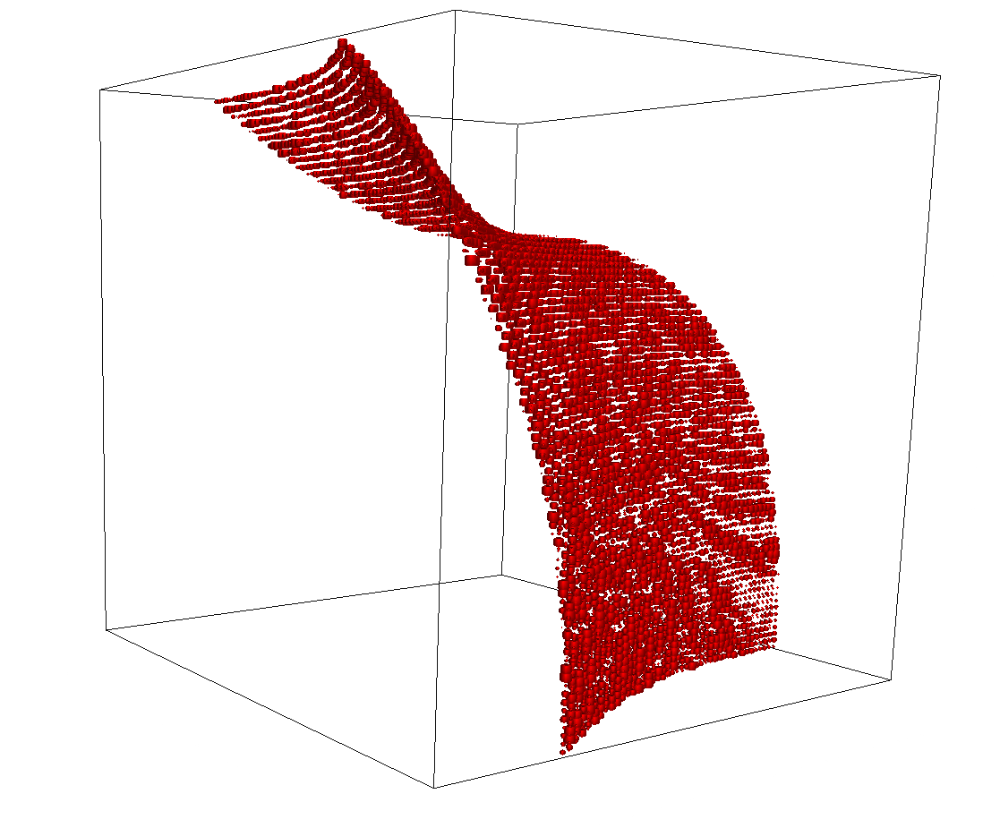
</th>
<th>
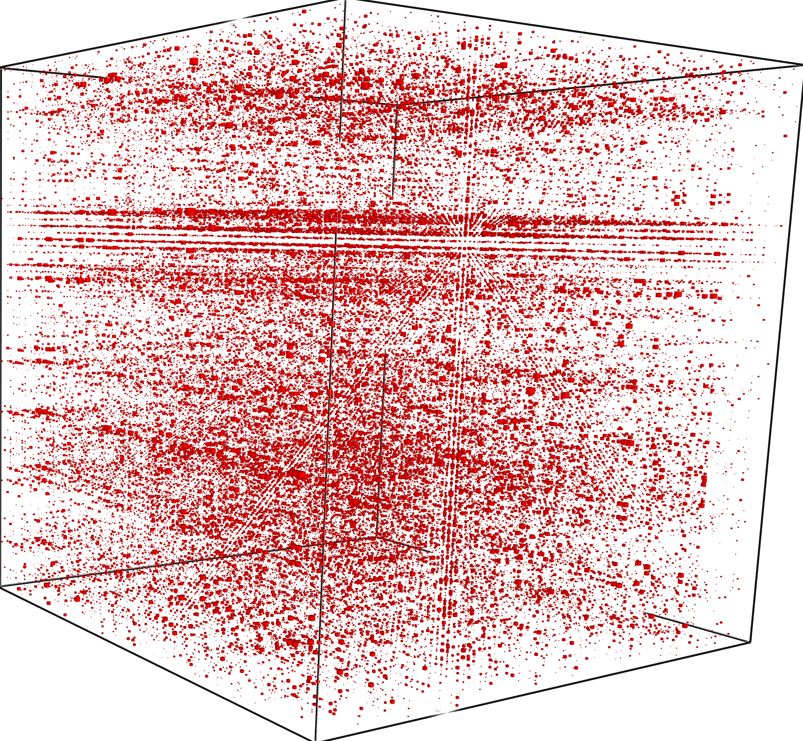
</th>
<th>
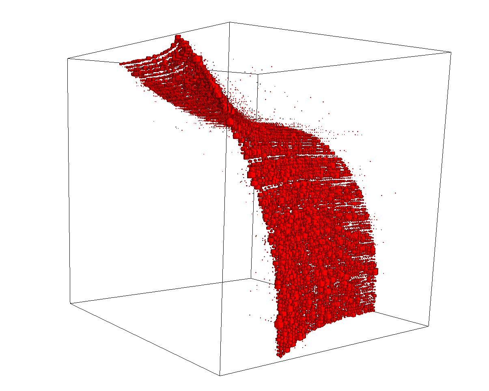
</th>

</table>
      <!--  -->
<!-- </div> -->


## Contents

- [Contents](#contents)
- [Our Team](#our-team)
- [Acknowledgements](#acknowledgements)
- [Install](#install)
- [Samples](#samples)
    - [Strata](#strata)
    - [Channels](#channels)
    - [Blocks](#blocks)
    - [Steps](#steps)
- [Performance](#performance)

## What can we find?
Using the algebra of operators on tensors the Dleto methods recover change of coordinates into which tensor data is supported on a smaller valence.  For 3-tensors 
<center>
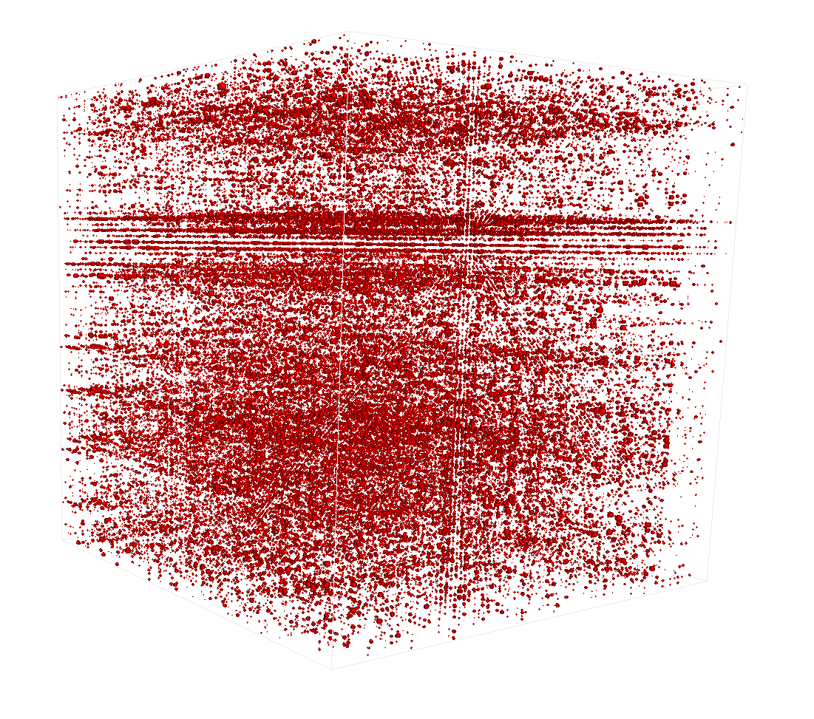
</center>

this means a to cluster the data near a block array of 2-tensors.  Here is what this looks like in some examples.

| [Strata](#strata) | [Channels](#channels) |
|---------------------|----------------|
| | 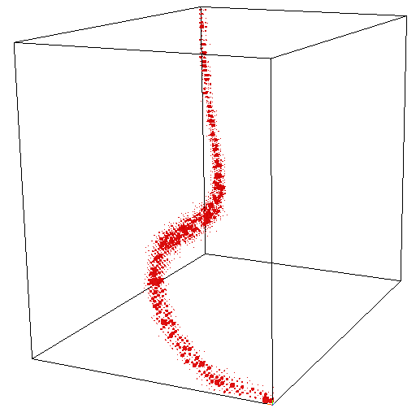 
|


| Hidden Source | Recovery after Randomization |
|------------------|----------------|
| 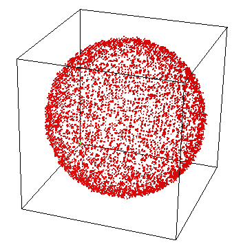  |   |
| 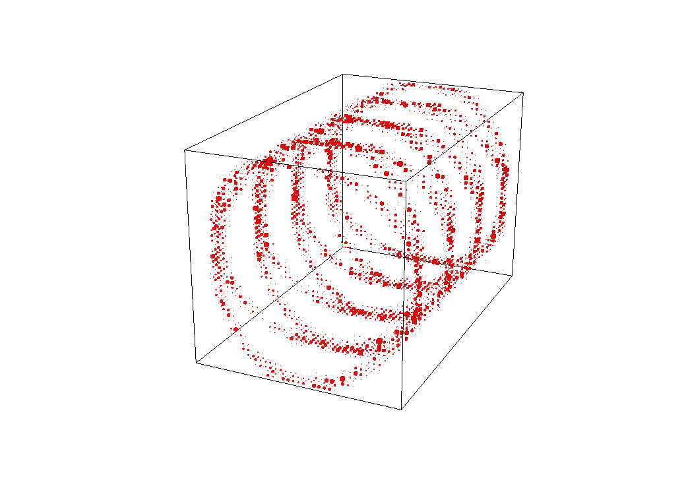  |  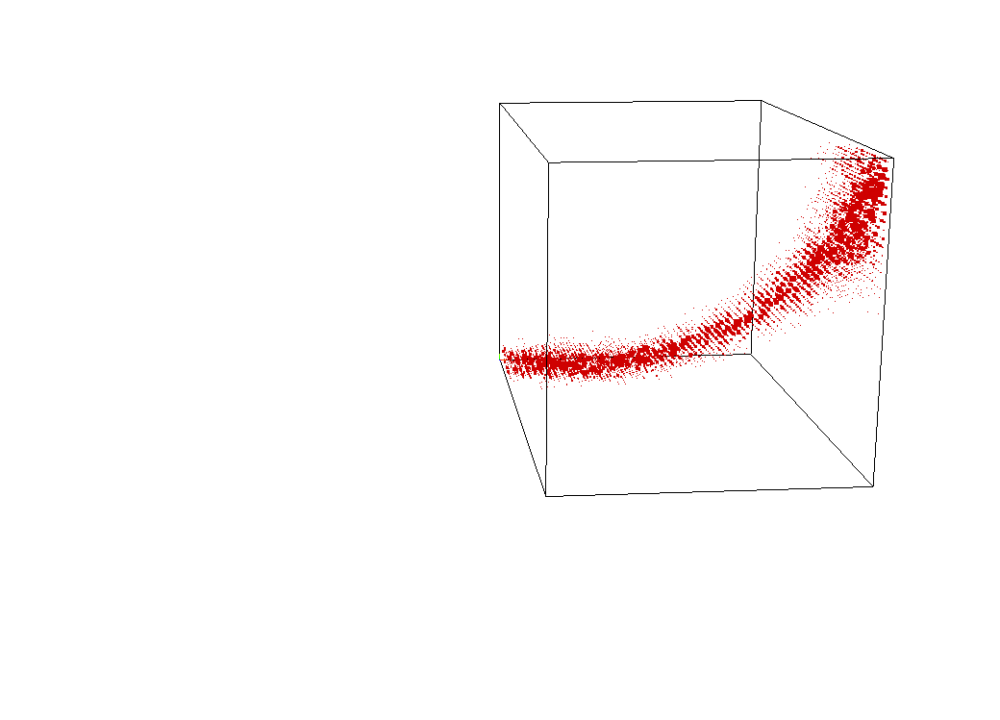 |
| 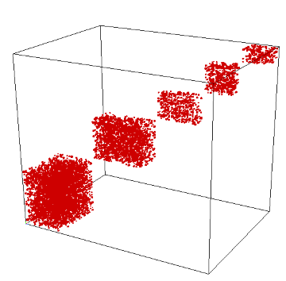  |  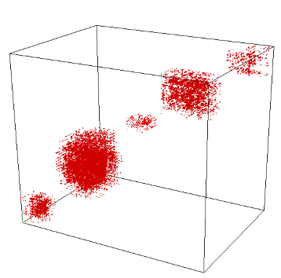 |
|   |  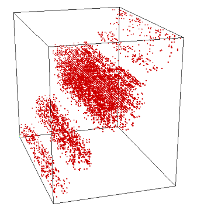 |


## Install

We have packaged just the essentials into a single file `Delto.jl` which has rudimentary but stand-alone implementations of some of the chiseling methods.  You may download that file alone, but you may also benefit from using the examples in `examples/..`.  Start with `examples/Demo.jl`.

 - Make sure to have a recent installation of the Julia Language, v. > 1.7.0 seems to compatabile with the features required for `OpenDleto`.  If you do not have an installation of Julia follow the installation instructions for the Julia system available [here](https://julialang.org/).
 - Clone or Download the `OpenDleto` release from github [here](https://github.com/thetensor-space/OpenDleto).  Make sure `julia` can be run from whatever folder contains your `OpenDleto` download, typically by ensuring that `julia` is in the path of your operating system shell.
 - From the command line start julia and load the `OpenDleto` package by using `include("$path$/OpenDleto/OpenDleto.jl")`
---
The functions mostly require standard Julia packages like `Random` and `LinearAlgebra`. The only other requirement is the package `Arpack` which will be installed by the above include command. It is recommended that this package is manually installed by and lines 5-6 in the file are commented out

```julia
julia> import Pkg
julia> Pkg.add("Arpack")
```

The code can be used without `Arpack` but it will run significantly slower. One needs to comment out the function `ArpackEigen` (lines 274-282) and change the defult function in from `ArpackEigen` to `LinearAlgebraEigen` in the function `toSurfaceTensor`, `toFaceCurveTensor` and `ToCurveTensor` (lines 358, 396  and 436)


Our algorithms are provided in a number of platforms.   
  * The bleeding edge algorithms are developed and tested for [Magma Computer Algebra System](http://magma.maths.usyd.edu.au/magma/).  Core tensor algorithms are distributed with that system and you can follow [TheTensor.Space](https://TheTensor.Space/) for details on extensions and experimental additions.
  * Python access is available to core algorithms through [SageTensorSpace](https://github.com/thetensor-space/SageTensorSpace) for the [Sage Math](https://www.sagemath.org/) (in Python).
  * [Julia](https://julialang.org/) language port is being developed as [OpenDelto](https://github.com/thetensor-space/OpenDleto).

The algorithms presented in this tutorial are for instructional purposes.  For detailed treatments and improved performance follow the attached references.

---

## Our Team

We invite you explore the repository and join our team.  We welcome and encourage any contributions to the repository. If you need help getting started, please feel free to @-mention any of the contributors below or you can read the repository's [Projects](https://github.com/thetensor-space/TensorSpace/projects) tab.

|                                                                              | Name                | Username                         | Affiliation                |
-------------------------------------------------------------------------------|---------------------|----------------------------------|----------------------------|
      | Prof. Peter A. Brooksbank, Ph.D. | [`@galois60`](https://github.com/galois60)                | Bucknell University |
  | Prof. Martin Kassabov, Ph.D.     | [`@kassabov`](https://github.com/kassabov)        | Cornell University  |
      | Joshua Maglione, Ph.D. | [`@joshmaglione`](https://github.com/joshmaglione)                | Bucknell University |
       | Amaury V. Miniño    | [`@amaury-minino`](https://github.com/amaury-minino)                  | Colorado State University |
       | Prof. James B. Wilson, Ph.D.     | [`@algeboy`](https://github.com/algeboy)                  | Colorado State University |


## Acknowledgments

We also acknowledge the partial support by the following granting organizations over the years.

**Portions of the project sponsored by:**
 * The National Science Foundation (USA) to Peter A. Brooksbank (DMS-1620454), to Martin Kassabov (DMS-1620454) to James B. Wilson (DMS-1620454).
 * The Simons Foundation to Peter A. Brooksbank (281435) to Martin Kassabov, and to James B. Wilson (636189).
 * The National Security Agency Math Sciences Program to Peter A. Brooksbank (Grant Number H98230-11-1-0146) to James B. Wilson (Grant Number H98230-19-1-00).

We also acknowledge the institutes that hosted research on these TheTensor.Space over the years.

 * The Colorado State University
 * Kent State University
 * The University of Auckland
 * Bucknell University
 * University Bielefeld
 * Hausdorff Institute For Mathematics
 * Isaac Newton Institute (EPSRC Grant Number EP/R014604/1)
 

---

---

## Samples

### Strata

A tensor supported on a surface.


A random change of basis to the above tensor.


The result of reconstruction 

---


## Usage

### Functions for Generating Stratified Tensors

The functions `randomSurfaceTensor`, `randomFaceCurveTensor` and `randomCurveTensor` produce tensors which are supported near a surface/face-curve/curve.  The inputs of the these functions consist of 3 arrays which define the resctiction; and an parameter cutoff which govern how thick the supports is

The helper functions `testSurfaceTensor`, `testFaceCurveTensor` and `testCurveTensor` measure if a tensor is supported near a surface/facecurve/curve with the given equation.
The outout is between 0 and 1 where 0 means that the tensor is exactly supported on restriction. These functions are nor perfectly normalized - for many restrictions random tensors have values around 0.5. 

### Functions for Stratifing Tensors

The functions `toSurfaceTensor`, `toFaceCurveTensor` and `toCurveTensor` attempt to stratify a given tensor by making otrthogonal transformation of the 3 coordinates spaces and produce a tensor with a restricted support. The input is a simple 3 dimensional array. There is a second optional argument which is a function which performs an SVD of a large system of linear equations.

The output is a named tuples with 7 components `.tensor` is the transformed tensor, `.Xchange`, `.Ychange` and `.Zchange` are the 3 orthogonal matrices used to do the transformation; and `.Xes`, `.Yes` and `.Zes` are vectors which restrict the support. 

It is recommnded to apply these functions only to non-degenerate tensors (ie tensors which can not be shrunk using HoSVD) - if the tensor is degenerate these functions are likely to discover the degenerations and not find any additional structure.

The functions have not been tested on abstract arrays -- if the input is a sparse tensor represented as some `AbstractArray`, it might be necessary to conver it to a normal `Array`.   

## Examples

The included files provides examples how these functions can be used. Here is a basic example showing that this code can be used to recover diagonal block decomposition of tensors.

First load the file

```julia
julia> include("stratification.jl") 
```

Define 3 arrays which describe the block structure

```julia
julia> Xes = [1,1,2,2,2,3,3,3]
julia> Yes = [1,1,1,2,2,3,3,3]
julia> Zes = [1,1,1,2,2,2,3,3]
```
```
8-element Vector{Int64}:
 1
 1
 2
 2
 2
 3
 3
 3

8-element Vector{Int64}:
 1
 1
 1
 2
 2
 3
 3
 3

8-element Vector{Int64}:
 1
 1
 1
 2
 2
 2
 3
 3
```
Generate a 8x8x8 tnesor consisting of blocks of size 2x3x3 3x2x3 and 3x3x2
```julia
julia> tensorDiagonalBlock = randomCurveTensor( Xes, Yes, Zes, 0.1)
```
```
8×8×8 Array{Float64, 3}:
[:, :, 1] =
 0.281444  -0.771449  -0.230731  0.0  0.0  0.0  0.0  0.0
 0.68989    0.353554  -0.963161  0.0  0.0  0.0  0.0  0.0
 0.0        0.0        0.0       0.0  0.0  0.0  0.0  0.0
 0.0        0.0        0.0       0.0  0.0  0.0  0.0  0.0
 0.0        0.0        0.0       0.0  0.0  0.0  0.0  0.0
 0.0        0.0        0.0       0.0  0.0  0.0  0.0  0.0
 0.0        0.0        0.0       0.0  0.0  0.0  0.0  0.0
 0.0        0.0        0.0       0.0  0.0  0.0  0.0  0.0

[:, :, 2] =
  0.831795  -0.558895  1.73975   0.0  0.0  0.0  0.0  0.0
 -0.769265   1.03611   0.600005  0.0  0.0  0.0  0.0  0.0
  0.0        0.0       0.0       0.0  0.0  0.0  0.0  0.0
  0.0        0.0       0.0       0.0  0.0  0.0  0.0  0.0
  0.0        0.0       0.0       0.0  0.0  0.0  0.0  0.0
  0.0        0.0       0.0       0.0  0.0  0.0  0.0  0.0
  0.0        0.0       0.0       0.0  0.0  0.0  0.0  0.0
  0.0        0.0       0.0       0.0  0.0  0.0  0.0  0.0

[:, :, 3] =
 0.470298  -0.678797  0.197142  0.0  0.0  0.0  0.0  0.0
 1.41462   -1.02874   0.253569  0.0  0.0  0.0  0.0  0.0
 0.0        0.0       0.0       0.0  0.0  0.0  0.0  0.0
 0.0        0.0       0.0       0.0  0.0  0.0  0.0  0.0
 0.0        0.0       0.0       0.0  0.0  0.0  0.0  0.0
 0.0        0.0       0.0       0.0  0.0  0.0  0.0  0.0
 0.0        0.0       0.0       0.0  0.0  0.0  0.0  0.0
 0.0        0.0       0.0       0.0  0.0  0.0  0.0  0.0

[:, :, 4] =
 0.0  0.0  0.0   0.0       0.0       0.0  0.0  0.0
 0.0  0.0  0.0   0.0       0.0       0.0  0.0  0.0
 0.0  0.0  0.0  -1.67667  -2.17101   0.0  0.0  0.0
 0.0  0.0  0.0  -1.16819   0.205952  0.0  0.0  0.0
 0.0  0.0  0.0   1.75122  -0.767267  0.0  0.0  0.0
 0.0  0.0  0.0   0.0       0.0       0.0  0.0  0.0
 0.0  0.0  0.0   0.0       0.0       0.0  0.0  0.0
 0.0  0.0  0.0   0.0       0.0       0.0  0.0  0.0

[:, :, 5] =
 0.0  0.0  0.0   0.0        0.0       0.0  0.0  0.0
 0.0  0.0  0.0   0.0        0.0       0.0  0.0  0.0
 0.0  0.0  0.0  -1.57631    1.23094   0.0  0.0  0.0
 0.0  0.0  0.0  -0.590718   0.951459  0.0  0.0  0.0
 0.0  0.0  0.0  -0.456224  -1.44161   0.0  0.0  0.0
 0.0  0.0  0.0   0.0        0.0       0.0  0.0  0.0
 0.0  0.0  0.0   0.0        0.0       0.0  0.0  0.0
 0.0  0.0  0.0   0.0        0.0       0.0  0.0  0.0

[:, :, 6] =
 0.0  0.0  0.0   0.0        0.0       0.0  0.0  0.0
 0.0  0.0  0.0   0.0        0.0       0.0  0.0  0.0
 0.0  0.0  0.0   1.43575   -1.07418   0.0  0.0  0.0
 0.0  0.0  0.0  -0.237536  -0.631201  0.0  0.0  0.0
 0.0  0.0  0.0   0.320036  -0.783304  0.0  0.0  0.0
 0.0  0.0  0.0   0.0        0.0       0.0  0.0  0.0
 0.0  0.0  0.0   0.0        0.0       0.0  0.0  0.0
 0.0  0.0  0.0   0.0        0.0       0.0  0.0  0.0

[:, :, 7] =
 0.0  0.0  0.0  0.0  0.0  0.0        0.0        0.0
 0.0  0.0  0.0  0.0  0.0  0.0        0.0        0.0
 0.0  0.0  0.0  0.0  0.0  0.0        0.0        0.0
 0.0  0.0  0.0  0.0  0.0  0.0        0.0        0.0
 0.0  0.0  0.0  0.0  0.0  0.0        0.0        0.0
 0.0  0.0  0.0  0.0  0.0  1.28909    0.205456   2.22163
 0.0  0.0  0.0  0.0  0.0  0.658314  -0.182946  -0.892084
 0.0  0.0  0.0  0.0  0.0  0.322976   1.39161    0.83425

[:, :, 8] =
 0.0  0.0  0.0  0.0  0.0   0.0        0.0      0.0
 0.0  0.0  0.0  0.0  0.0   0.0        0.0      0.0
 0.0  0.0  0.0  0.0  0.0   0.0        0.0      0.0
 0.0  0.0  0.0  0.0  0.0   0.0        0.0      0.0
 0.0  0.0  0.0  0.0  0.0   0.0        0.0      0.0
 0.0  0.0  0.0  0.0  0.0  -0.380632  -1.22248  1.88636
 0.0  0.0  0.0  0.0  0.0  -1.04584    1.52227  0.376
 0.0  0.0  0.0  0.0  0.0  -1.31282   -1.16861  0.00662803
```

Randomize the tensor by generating there 8x8 ortogonal matrices and performing the change of basis 
```julia
julia> rTensorDiagonalBlock = randomizeTensor(tensorDiagonalBlock)
```
```
(tensor = [-0.7024746276104429 0.2963471007139938 … 0.1253521132232702 -0.23687256022017183; -0.45865089367528006 0.016337187635288155 … -0.22612587931949799 0.06041606592870537; … ; -0.2563707902130204 -0.24131170735091761 … -0.16487227524045395 0.008929327353449163; 0.03108960314383061 -0.007970200573260824 … 0.06600293704539476 -0.7767924232426673;;; 0.17215267649320465 0.5279826208177606 … -0.30737386702533814 0.06261041792500442; 0.025670359458514633 0.4363149673506537 … 0.6348412014860125 -0.16416012911710126; … ; 0.07071570841449397 0.000405164340436413 … 0.12002904521231536 0.1460881197735838; 0.8339145938983152 -0.8600486025999846 … -0.04488674234304724 -0.1659782122918398;;; 0.3077280505781425 -0.16669703274753525 … 0.24312774440072013 -0.13971623080004564; -0.0028081143958506097 0.7073393976346791 … 0.47207333789018396 -0.4623091303747916; … ; -0.1577127916675091 -0.03846313180963299 … -0.0733907706806753 0.32042203586418383; 0.5808429007280725 0.026924918165430457 … -0.4192224118414693 -0.3041357120853166;;; 0.27376822924953426 0.14670564491930838 … 0.16314011895435693 0.14549450615965745; -0.22609705908083771 0.18674534297040812 … 0.3505409252246221 0.754302045081575; … ; 0.3147576224123127 -0.21065952426400014 … -0.11449745239753754 -0.016886070065897235; 0.104196222273735 0.8904678672071237 … 0.3776315743197468 -0.2690904374015832;;; -0.2222043354717667 0.016611735719920903 … -0.12027468260084041 -0.32877368121925893; 0.22628597857093963 0.30569763810461786 … 0.09064176560334732 -0.38840299035583453; … ; -0.31669968800672976 -0.15143232286399796 … -0.15342087554252004 0.3790755632358135; 0.15536125477604426 0.1846989003199384 … 0.14269325649118003 -0.5399927811607663;;; -0.8450534611467111 -0.3444415369606425 … 0.0034731112877044636 -0.38777284007413; 0.052313798990970224 0.052135969241617904 … -0.5075489375730434 -0.014108904610416691; … ; -0.4083102782429647 -0.10130782689805153 … -0.20873158194616379 -0.4735001474552224; -0.15152593852746163 -0.09557737182663935 … -0.618814174948011 0.17332882686295284;;; -0.036320019205084465 -0.13377859028407804 … -0.04363011189969535 -0.2078098147895931; -0.5325619093768249 0.412043838916253 … 0.2827449957835387 0.30306238279288483; … ; 0.01719075969753439 0.08447212632098523 … -0.07089280073125985 -0.03290524905544018; 0.1596917359556732 -0.14035696691206537 … 0.0015949950726324243 -0.435208644446437;;; 0.0014902689258033555 0.06474145222948877 … -0.274174083096012 0.12567985751366126; 0.6011212069014038 -0.35012447518192336 … -0.09123144883709783 0.4388412135290433; … ; 0.0010940474822821904 0.17497787872327328 … -0.01612379164743524 -0.15352081296032266; 0.1533341090670312 -0.059494131630283845 … 0.29375990461560275 0.4061122899637345], Xchange = [0.4744167209451655 -0.1296375671813731 … -0.012087726879920574 -0.5886988008656266; 0.06612714846898976 0.021704090163151 … -0.19636524043757542 0.3067559502282672; … ; -0.6283746195807594 -0.26810125433120097 … -0.5858150602428649 -0.299802172385621; 0.5394919937599101 -0.3836748188990333 … -0.44085939330645313 -0.08906163078837666], Ychange = [0.08701473096783985 0.6940240478195556 … -0.25972423096579006 0.2712638074316892; 0.34529335636032543 -0.08639930381652763 … -0.43013624477157253 -0.0358525901371598; … ; 0.3997686156141235 0.10861763183087642 … -0.25454657840375794 0.13790871547913763; 0.5018035337509246 0.10679006071176456 … 0.17455422379379232 0.28553005126967135], Zchange = [0.49479909752742235 -0.024868077103067543 … -0.31626889487766274 0.32789131052857295; 0.3938416253385604 0.612693825853946 … 0.06046705920253505 0.294662706624177; … ; -0.0909145238816364 -0.012437687502620587 … -0.07060232475092618 -0.48496235569884527; 0.5124789641010667 -0.33249134518184065 … 0.071533630976055 -0.5326894477876711]
```

Show the randomized tensor

```julia
julia> rTensorDiagonalBlock.tensor
```
```
8×8×8 Array{Float64, 3}:
[:, :, 1] =
 -0.702475    0.296347    0.00247473  -0.287948    0.241706      0.418138    0.125352   -0.236873
 -0.458651    0.0163372   0.259663     0.372776   -0.0265987    -0.482275   -0.226126    0.0604161
  0.20742     0.24801     0.0610537    0.222524    0.394471      0.0483035   0.115085    0.198717
 -0.13426     0.283201   -0.165056     0.226389    0.2382       -0.323128    0.531379    0.107345
 -0.118286    0.548111    0.0531631    0.0731164  -0.751058     -0.494927   -0.387676   -0.212955
 -0.067795    0.89809    -0.175167     0.454094    0.088632      0.014222    0.7071     -0.58209
 -0.256371   -0.241312    0.123928     0.308604   -0.000613099   0.614024   -0.164872    0.00892933
  0.0310896  -0.0079702   0.402639     0.333913    0.441475     -0.518071    0.0660029  -0.776792

[:, :, 2] =
  0.172153    0.527983     -0.332397   -0.0273464  -0.493023    0.0771282  -0.307374    0.0626104
  0.0256704   0.436315     -0.0696738   0.352501    0.342413   -0.233131    0.634841   -0.16416
 -0.191051    0.429594     -0.331955   -0.134498    0.0220322  -0.0794263  -0.384593   -0.229604
  0.111402   -0.0608521     0.312597    0.167226    0.0310144  -0.138406    0.204569   -0.520867
  0.0359766   0.320652     -0.417782   -0.354215   -0.113355    0.868436   -0.108717    0.0234906
  0.33696    -0.192297      0.0454511  -0.588523   -0.409182    0.267245   -0.373037   -0.474059
  0.0707157   0.000405164  -0.0333864  -0.288611   -0.0801911  -0.443863    0.120029    0.146088
  0.833915   -0.860049      0.147022   -0.160017    0.134369    0.218815   -0.0448867  -0.165978

[:, :, 3] =
  0.307728    -0.166697    0.321589   0.10504    -0.136093    -0.164758    0.243128   -0.139716
 -0.00280811   0.707339   -0.11406    0.329135    0.197757    -0.199973    0.472073   -0.462309
  0.143506     0.0638417   0.859034  -0.107018    0.036768    -0.206582    0.397439   -0.115088
 -0.0644163    0.413575   -0.291898   0.151935    0.0200681   -0.0465648  -0.0307345  -0.551136
  0.321374    -0.427418    0.241959  -0.0564599   0.0359606    0.282802    0.297945   -0.104407
  0.687186    -0.157065   -0.026119  -0.442352   -0.283112     0.259708   -0.1488     -1.19558
 -0.157713    -0.0384631  -0.239535  -0.128573   -0.00761089  -0.297398   -0.0733908   0.320422
  0.580843     0.0269249  -0.105542  -0.440249   -0.219728     0.566895   -0.419222   -0.304136

[:, :, 4] =
  0.273768   0.146706    0.154395    0.321822  -0.28801    -0.37823     0.16314     0.145495
 -0.226097   0.186745   -0.243589    0.240824   0.273216   -0.0532978   0.350541    0.754302
 -0.468163   0.559502    0.491102   -0.376334  -0.462962   -0.0549783   0.169507    0.205869
 -0.44377    0.215609   -0.0902764   0.500775   0.307063   -0.413063    0.0472074  -0.051226
  0.125337   0.0926563   0.0434762   0.220054   0.388473    0.3851      0.678224   -0.154299
 -0.442523   0.558775    0.0333715   0.428467   0.352476   -0.923862    0.453365   -0.471618
  0.314758  -0.21066    -0.218337   -0.526293  -0.0643646  -0.496211   -0.114497   -0.0168861
  0.104196   0.890468   -0.192724    0.204366  -0.0506031   0.0771721   0.377632   -0.26909

[:, :, 5] =
 -0.222204   0.0166117   -0.0298128   0.0679532   0.24579     0.0649964  -0.120275   -0.328774
  0.226286   0.305698     0.0759898   0.401641   -0.192561   -0.0322167   0.0906418  -0.388403
 -0.217139  -0.00729125  -0.601355   -0.117896    0.0715049  -0.254061    0.0152805  -0.274018
 -0.128594   0.314261     0.186989    0.049009    0.153264   -0.115334    0.348303   -0.0805861
  0.397388   0.149734    -0.113519    0.620894   -0.0923104   0.0380862  -0.147295    0.0531028
  0.447229   0.552056     0.118877   -0.33665     0.101955   -0.163949    0.31943    -1.35773
 -0.3167    -0.151432     0.136947   -0.382661    0.0139397  -0.413117   -0.153421    0.379076
  0.155361   0.184699     0.0206701   0.24769    -0.303881    0.143143    0.142693   -0.539993

[:, :, 6] =
 -0.845053   -0.344442    0.410077  -0.282004   0.463111   0.534818    0.00347311  -0.387773
  0.0523138   0.052136    0.240219   0.697709  -0.496851  -0.130202   -0.507549    -0.0141089
 -0.050787    0.307767    0.148974  -0.70008   -0.177233   0.0972879   0.326851     0.175916
  0.202517   -0.170581   -0.289877  -0.312865   0.269599   0.157883    0.111042    -0.0614107
  0.782345   -0.0718234   0.254037   0.998983  -0.903972  -0.224231   -0.468759     0.286396
 -0.0617606  -0.562675   -0.175735  -0.643401   0.238106  -0.0281522  -0.0546479    0.430692
 -0.40831    -0.101308    0.131137  -0.298939   0.116913  -0.357528   -0.208732    -0.4735
 -0.151526   -0.0955774   0.186176   0.212185  -0.399937   0.326532   -0.618814     0.173329

[:, :, 7] =
 -0.03632    -0.133779   -0.102505    0.132605    0.360818   -0.107398    -0.0436301  -0.20781
 -0.532562    0.412044    0.0346942   0.478511    0.126058   -0.437275     0.282745    0.303062
  0.0225267  -0.590152   -0.637609    0.51462     0.535709   -0.494483     0.0753524  -0.342361
 -0.149266    0.64897     0.205562    0.0235813  -0.0865639  -0.0402893    0.350529   -0.0979107
  0.336398   -0.123433   -0.0536402   0.11789     0.0916253  -0.102047    -0.218299   -0.307972
  0.0420125   0.326338    0.117449   -0.0269389   0.0472393   0.00314654   0.119853   -0.156518
  0.0171908   0.0844721   0.170145   -0.162205   -0.120738    0.179703    -0.0708928  -0.0329052
  0.159692   -0.140357   -0.0471676  -0.103209   -0.279229    0.173        0.001595   -0.435209

[:, :, 8] =
  0.00149027   0.0647415  -0.0312331   0.199073  -0.245487   -0.0904413  -0.274174    0.12568
  0.601121    -0.350124   -0.131066    0.10503   -0.158538    0.472491   -0.0912314   0.438841
 -0.0404055   -0.549661   -0.0472311  -0.373463   0.507555   -0.656963   -0.272479   -0.164481
 -0.271       -0.207561    0.137217   -0.186691  -0.123771    0.209469   -0.177623    0.222741
  0.258489     0.325605   -0.295374    0.727436   0.0557086   0.713551    0.324661    0.45089
 -0.757087     0.122226   -0.0174641  -0.507927  -0.0364498  -0.624282   -0.0562659   0.475568
  0.00109405   0.174978   -0.099142   -0.996827  -0.282081   -0.957327   -0.0161238  -0.153521
  0.153334    -0.0594941   0.0159036   0.768976   0.328615   -0.199072    0.29376     0.406112

```

Run the algorthm on the resulting tensor
```julia
jualia> resRandomDiagonalBlock=toCurveTensor(rTensorDiagonalBlock.tensor)
```
```
(tensor = [2.522167441185261 1.1205903752896191 … 4.663513226650628e-16 7.944375935783431e-16; 1.4706704329365592 0.005728378852994986 … 7.527732293872729e-16 6.596708505411562e-16; … ; 1.4457065595388649e-15 7.988439986282894e-16 … 8.519457477147969e-16 1.0956121334688278e-15; -7.503027232723816e-16 1.0995788660076533e-15 … 2.123396700476875e-16 -8.75114787461572e-16;;; 0.8846373128626783 -1.3100718398801987 … 7.724206699978667e-16 -8.369596809421778e-16; 0.04000825619020491 1.0998022676212074 … -6.880571515817601e-16 -9.199924325467899e-17; … ; 4.788099823024108e-16 -8.29150270367448e-16 … 1.3887055829946707e-16 -4.1165826027083053e-16; 5.689860403802004e-16 -2.6745682755962364e-15 … 1.0958035016443158e-16 -6.982681721920173e-16;;; -2.108355599173611e-15 4.580203197690917e-17 … -3.5040673131298044e-17 7.172464184101075e-18; -7.199364977463047e-16 -7.906906063181214e-16 … 1.5293236169512242e-17 -6.985708151737266e-17; … ; 5.193338698775587e-17 -5.575771830359343e-18 … -1.9351776528218928e-15 -1.790077349324323e-15; 7.11714654367747e-17 -3.2742788568521557e-17 … -2.1922179439439517e-16 1.0115074623858426e-15;;; -2.334783904209992e-15 -1.4443087233156743e-15 … 7.135064112274865e-18 2.6324892646381753e-17; -1.4983923409695667e-15 3.6087681890593516e-16 … 3.839308393829004e-17 4.348394409941564e-17; … ; -3.6373447097258985e-19 9.9204594633917e-18 … -1.418613113533548e-15 -1.4567273517816767e-15; 6.836224487020565e-18 -7.831477234102301e-17 … -5.226804812284285e-16 2.3090987739615883e-15;;; -4.877734661962187e-15 -1.903701952733988e-15 … 4.140046776652075e-18 -3.237622590251839e-17; -2.582225472245621e-15 -6.740261977186425e-17 … 3.967741697578755e-17 4.8910625512160073e-17; … ; -1.1883176586491551e-17 4.9380003305519774e-17 … -7.142897090334068e-16 1.374818477270037e-15; 9.863962881996122e-18 -2.946167637516214e-17 … -2.676534162613924e-16 1.9709309822032316e-16;;; -1.4753031931194904e-15 7.9740065836597125e-16 … 3.6417886250331893e-16 -3.3276033800280633e-16; -4.800993321153344e-16 -9.289479217926204e-16 … 2.890460837605447e-16 -2.7334763581668492e-15; … ; -9.10323143942879e-16 4.549051397765812e-16 … 0.6617432077842805 -0.4422350214249645; -1.597027607757424e-16 1.4664763474759782e-15 … 0.49234232819009843 -1.8043053392039574;;; -1.97132378543493e-16 2.3230026636912776e-16 … -1.06502593262581e-15 -1.7914043465672285e-16; 1.6929045586602933e-16 -1.5964272022012813e-16 … 7.55205964554474e-16 1.0414498198611812e-15; … ; 1.0506214296080965e-15 7.448303566507221e-16 … -1.7556782300013851 -0.3647117126455474; 8.656487117304513e-16 -4.921755959251218e-16 … -0.2787317830800355 0.45695140127367023;;; 1.1469071264434575e-15 3.818826538989276e-16 … -2.0486001311755876e-16 -9.495114689100094e-16; 5.690796070050924e-16 9.635657282887038e-17 … 1.9945890906140387e-16 1.990226423401654e-15; … ; 4.0304901547913027e-17 1.6197436152923054e-15 … -0.2666756833710847 -1.7373040425865105; 1.0009783710781039e-16 -4.86057790105166e-16 … 0.0024221870233757502 0.5070589280924723], Xchange = [-0.30391648613709155 0.49492217286520146 … -0.30741452783384354 -0.3673422558782188; -0.38459635349410204 0.22296100230806623 … 0.05026916838399825 0.1214494835909029; … ; 0.3063146820225401 0.7390939309540691 … 0.17294980433521212 -0.09377518847564459; -0.3778245990601943 0.2192718962913001 … 0.051698257426139885 0.6618102305949757], Ychange = [-0.09463120032903263 -0.4988957617347311 … 0.09308815850170468 -0.29630698692843754; 0.003536757550233565 -0.1321651779224803 … -0.18363147802189336 0.5568959994911196; … ; 0.010200790188643089 -0.5676875269027027 … 0.5235385860313793 0.029298967612758575; -0.0588626673825768 -0.3455651359353808 … 0.11256543269428784 0.14717137506051753], Zchange = [-0.36040773857175484 0.375508190691389 … 0.19230178000746806 -0.09541674541714074; 0.2759266036784542 -0.18592928783200177 … -0.31142307444176637 0.32188756471820107; … ; -0.016172453576257184 0.09919778407896743 … -0.3783949026145276 -0.563325964410051; 0.7161672244405628 0.07778843658545467 … 0.05498177119767794 -0.45966162524243376], Xes = [-0.3061464133293273, -0.30614641332932696, -0.3061464133293266, -0.1855828993807031, -0.18558289938070266, -0.18558289938070252, -0.07973683604986744, -0.07973683604986723], Yes = [-0.3061464133293272, -0.30614641332932707, -0.30614641332932657, -0.18558289938070288, -0.18558289938070271, -0.07973683604986775, -0.07973683604986755, -0.0797368360498672], Zes = [-0.30614641332932774, -0.3061464133293272, -0.18558289938070288, -0.18558289938070266, -0.1855828993807025, -0.07973683604986735, -0.07973683604986725, -0.07973683604986709])
```

Extract the tensor from the output
```
julia> resRandomDiagonalBlock.tensor
```
```
8×8×8 Array{Float64, 3}:
[:, :, 1] =
  2.52217       1.12059      -0.491479      4.0323e-15   -4.08632e-16  -4.04046e-16   4.66351e-16   7.94438e-16
  1.47067       0.00572838    0.830886     -2.73681e-16   1.06175e-15   1.62469e-15   7.52773e-16   6.59671e-16
 -0.135353      0.88032       0.118945      1.41011e-15  -3.00197e-16  -7.01585e-16  -4.76114e-16   4.09818e-16
 -2.24043e-15  -2.16845e-16   6.57912e-16  -3.96042e-16   7.92829e-17   8.67136e-18   2.55006e-17   3.18406e-17
  2.22845e-16   1.19605e-15   1.84197e-15  -1.38946e-15   3.48968e-15  -3.53214e-17  -1.30206e-17  -2.15168e-17
 -4.15721e-15  -6.33216e-17   2.05346e-15   3.88009e-15  -8.51112e-16   4.74293e-17   1.96653e-17   1.66924e-17
  1.44571e-15   7.98844e-16  -2.30331e-16  -1.93393e-17  -7.67856e-17  -4.09608e-16   8.51946e-16   1.09561e-15
 -7.50303e-16   1.09958e-15  -1.40573e-15  -8.21914e-18  -1.24638e-16   1.89832e-16   2.1234e-16   -8.75115e-16

[:, :, 2] =
  0.884637     -1.31007      -1.04278      -6.87793e-16   1.64758e-16   2.6239e-16    7.72421e-16  -8.3696e-16
  0.0400083     1.0998       -1.31048       3.57497e-15  -1.61414e-15  -2.42903e-15  -6.88057e-16  -9.19992e-17
  0.286426     -0.585098     -2.00498       1.44944e-15  -1.35172e-15  -1.85796e-15   1.01281e-16  -1.02827e-15
 -5.95974e-16   8.48881e-16  -1.23115e-15   6.50744e-17  -6.8735e-16   -5.39626e-17   4.06383e-18  -3.23056e-19
  1.21473e-16   1.27586e-15  -5.3657e-15   -1.05402e-15  -8.51879e-16  -1.52024e-17   1.03399e-17   4.11197e-18
 -1.02187e-15   2.04807e-15  -3.98539e-15   6.87546e-16   5.35547e-16  -8.06305e-17  -9.43021e-18   1.50217e-17
  4.7881e-16   -8.2915e-16   -6.44141e-16   5.93032e-18  -2.00895e-17   2.51905e-16   1.38871e-16  -4.11658e-16
  5.68986e-16  -2.67457e-15   2.60366e-16  -1.34718e-17   2.54442e-17  -1.1347e-16    1.0958e-16   -6.98268e-16

[:, :, 3] =
 -2.10836e-15   4.5802e-17    8.49539e-16   1.43192e-16  -6.7975e-16   -2.35891e-17  -3.50407e-17   7.17246e-18
 -7.19936e-16  -7.90691e-16   4.28171e-16   2.22919e-15  -1.01366e-15   2.10893e-18   1.52932e-17  -6.98571e-17
 -6.75437e-17  -1.27758e-16   1.04161e-15   9.79529e-16  -1.7383e-16   -7.80908e-17  -1.59726e-17   2.92271e-17
  7.4671e-18   -7.60379e-16   1.04979e-15   0.312846     -0.589409     -3.08086e-16  -1.32131e-16   3.47127e-17
  5.41306e-16   1.47269e-15  -2.73771e-16  -1.1175       -0.761157     -3.78684e-17  -4.51735e-16   4.80032e-16
 -3.46077e-16  -1.63198e-15   1.3577e-15    0.950679     -0.26616      -2.73867e-16   6.26477e-17  -3.02027e-16
  5.19334e-17  -5.57577e-18   5.84988e-17  -1.23883e-15   5.27237e-16   7.44866e-16  -1.93518e-15  -1.79008e-15
  7.11715e-17  -3.27428e-17  -8.4649e-18    3.75267e-15   1.42157e-15  -8.41695e-16  -2.19222e-16   1.01151e-15

[:, :, 4] =
 -2.33478e-15  -1.44431e-15   7.02981e-17   2.90215e-16   1.03974e-15  -1.98968e-17   7.13506e-18   2.63249e-17
 -1.49839e-15   3.60877e-16  -1.24068e-15   1.124e-15    -3.70058e-15  -2.31977e-17   3.83931e-17   4.34839e-17
  1.64393e-16  -1.04865e-15  -8.08823e-16  -1.73971e-16  -1.46424e-15  -3.14197e-17  -2.02231e-17  -4.44486e-17
 -2.83302e-16  -1.2728e-16   -5.66828e-16   0.353077      0.802246      2.51121e-16   3.10493e-16  -2.16298e-16
 -6.62355e-16  -1.7489e-15   -1.65719e-16   1.48504       1.38239       2.2366e-16    6.71003e-16  -6.76284e-16
  2.42742e-16  -1.38377e-15   2.5804e-15    0.306609     -1.91255      -8.37346e-16  -5.09604e-16   2.62656e-16
 -3.63734e-19   9.92046e-18   1.15547e-17  -6.13356e-16   1.86024e-15   1.07037e-17  -1.41861e-15  -1.45673e-15
  6.83622e-18  -7.83148e-17   1.78188e-17  -3.14375e-15  -5.1101e-15   -2.18782e-16  -5.2268e-16    2.3091e-15

[:, :, 5] =
 -4.87773e-15  -1.9037e-15    9.68498e-16  -1.01059e-15   1.28853e-16   4.64504e-17   4.14005e-18  -3.23762e-17
 -2.58223e-15  -6.74026e-17  -1.4203e-15    4.38384e-15   2.22177e-15  -1.84385e-17   3.96774e-17   4.89106e-17
  2.30029e-16  -1.51177e-15   1.85867e-17   1.68188e-15  -5.86924e-17  -6.40744e-17   5.21938e-19   4.37701e-17
  3.0844e-16    1.1187e-15   -6.38881e-16  -0.703288     -0.0889086     9.76923e-17  -1.7535e-16    1.98935e-16
  1.53974e-16   3.03407e-15  -3.90559e-15  -1.26312       2.22003       1.09573e-15   4.59876e-16  -7.48645e-17
 -1.03638e-15  -3.09007e-15   1.29335e-15   2.20638       0.857058     -1.96355e-17   6.51616e-16  -7.58594e-16
 -1.18832e-17   4.938e-17    -3.93119e-17  -2.29144e-15  -1.04717e-15  -1.88503e-16  -7.1429e-16    1.37482e-15
  9.86396e-18  -2.94617e-17  -8.23456e-17   5.15378e-15  -4.5351e-15    2.0728e-17   -2.67653e-16   1.97093e-16

[:, :, 6] =
 -1.4753e-15    7.97401e-16   1.15953e-15  -5.55897e-17  -8.33385e-17   2.88498e-16   3.64179e-16  -3.3276e-16
 -4.80099e-16  -9.28948e-16   9.49965e-16   4.22232e-17  -2.5465e-17   -5.35015e-16   2.89046e-16  -2.73348e-15
 -1.27275e-16   1.83079e-16   1.60557e-15   1.44136e-17  -9.28417e-17   2.2212e-16    8.37038e-16  -2.02637e-15
  5.64899e-18   5.94163e-17  -5.8559e-17    6.17671e-16   5.90854e-16   9.02735e-17  -5.24019e-16   1.48076e-15
  3.83886e-17  -3.85817e-17  -7.43163e-17   1.43884e-15  -1.32056e-16  -5.21071e-16   2.16527e-16  -2.14919e-15
  6.34745e-17  -1.58692e-17  -1.72794e-17  -4.8812e-16   -1.77176e-15   1.03633e-16  -1.93586e-15   5.75154e-15
 -9.10323e-16   4.54905e-16  -2.13709e-16  -2.06862e-16  -6.21183e-17   0.486715      0.661743     -0.442235
 -1.59703e-16   1.46648e-15   1.7463e-15   -3.57737e-17   4.49338e-16  -0.121927      0.492342     -1.80431

[:, :, 7] =
 -1.97132e-16   2.323e-16     6.74864e-17   4.94184e-17   7.2583e-17    1.82507e-16  -1.06503e-15  -1.7914e-16
  1.6929e-16   -1.59643e-16   2.74046e-16   5.22125e-17  -9.57143e-18  -1.4657e-15    7.55206e-16   1.04145e-15
 -6.13693e-17   9.62704e-17   1.99755e-16  -5.25127e-17   8.68069e-19  -3.24992e-16  -1.28287e-15   2.15638e-16
 -4.00154e-18   4.14104e-17  -9.12827e-17  -1.21056e-16   3.90874e-17   5.23553e-16   3.48697e-16  -3.94672e-16
 -2.65662e-17  -5.16069e-17  -2.80219e-17   7.08206e-16  -1.32845e-15  -1.33575e-15   9.60838e-16   9.05151e-16
  5.3941e-17    5.4411e-17   -1.70619e-17  -2.42244e-15   1.20941e-15   1.80486e-15   1.86809e-15  -1.27527e-15
  1.05062e-15   7.4483e-16   -8.5731e-18    7.18491e-16   2.63906e-16   0.529983     -1.75568      -0.364712
  8.65649e-16  -4.92176e-16   3.86665e-16   5.53585e-17   6.72167e-17  -0.690685     -0.278732      0.456951

[:, :, 8] =
  1.14691e-15   3.81883e-16  -4.52888e-16  -9.19638e-18  -2.32177e-17   1.083e-16    -2.0486e-16   -9.49511e-16
  5.6908e-16    9.63566e-17   3.21682e-16  -2.73522e-17  -2.85056e-17  -5.2123e-16    1.99459e-16   1.99023e-15
 -9.15864e-17   3.40839e-16  -2.02543e-16  -2.10722e-17   5.85528e-17   9.12366e-18  -1.72792e-16  -5.29594e-16
  2.97407e-17  -1.70129e-17   1.96499e-17  -1.32255e-15  -8.58097e-17   5.22297e-17   4.93885e-17  -3.29781e-16
  9.49004e-17   7.1126e-17   -1.71732e-18  -1.22493e-15   1.16244e-15  -5.32166e-16   1.53294e-16   1.93945e-15
  3.30005e-17   6.5724e-17   -5.24975e-17   1.16948e-16   2.98927e-15   4.43232e-16   1.59224e-16  -4.68934e-16
  4.03049e-17   1.61974e-15   9.73959e-16   3.83415e-16   4.40655e-16   0.356929     -0.266676     -1.7373
  1.00098e-16  -4.86058e-16  -2.04602e-16  -7.61651e-17  -1.3487e-16   -0.200466      0.00242219    0.507059
```

Remove small entries
```julia
julia> resRandomDiagonalBlock.tensor .|> x -> (abs(x) < 1e-10 ? 0 : x )
```
```
8×8×8 Array{Real, 3}:
[:, :, 1] =
  2.52217   1.12059     -0.491479  0  0  0  0  0
  1.47067   0.00572838   0.830886  0  0  0  0  0
 -0.135353  0.88032      0.118945  0  0  0  0  0
  0         0            0         0  0  0  0  0
  0         0            0         0  0  0  0  0
  0         0            0         0  0  0  0  0
  0         0            0         0  0  0  0  0
  0         0            0         0  0  0  0  0

[:, :, 2] =
 0.884637   -1.31007   -1.04278  0  0  0  0  0
 0.0400083   1.0998    -1.31048  0  0  0  0  0
 0.286426   -0.585098  -2.00498  0  0  0  0  0
 0           0          0        0  0  0  0  0
 0           0          0        0  0  0  0  0
 0           0          0        0  0  0  0  0
 0           0          0        0  0  0  0  0
 0           0          0        0  0  0  0  0

[:, :, 3] =
 0  0  0   0          0         0  0  0
 0  0  0   0          0         0  0  0
 0  0  0   0          0         0  0  0
 0  0  0   0.312846  -0.589409  0  0  0
 0  0  0  -1.1175    -0.761157  0  0  0
 0  0  0   0.950679  -0.26616   0  0  0
 0  0  0   0          0         0  0  0
 0  0  0   0          0         0  0  0

[:, :, 4] =
 0  0  0  0          0         0  0  0
 0  0  0  0          0         0  0  0
 0  0  0  0          0         0  0  0
 0  0  0  0.353077   0.802246  0  0  0
 0  0  0  1.48504    1.38239   0  0  0
 0  0  0  0.306609  -1.91255   0  0  0
 0  0  0  0          0         0  0  0
 0  0  0  0          0         0  0  0

[:, :, 5] =
 0  0  0   0          0          0  0  0
 0  0  0   0          0          0  0  0
 0  0  0   0          0          0  0  0
 0  0  0  -0.703288  -0.0889086  0  0  0
 0  0  0  -1.26312    2.22003    0  0  0
 0  0  0   2.20638    0.857058   0  0  0
 0  0  0   0          0          0  0  0
 0  0  0   0          0          0  0  0

[:, :, 6] =
 0  0  0  0  0   0         0          0
 0  0  0  0  0   0         0          0
 0  0  0  0  0   0         0          0
 0  0  0  0  0   0         0          0
 0  0  0  0  0   0         0          0
 0  0  0  0  0   0         0          0
 0  0  0  0  0   0.486715  0.661743  -0.442235
 0  0  0  0  0  -0.121927  0.492342  -1.80431

[:, :, 7] =
 0  0  0  0  0   0          0          0
 0  0  0  0  0   0          0          0
 0  0  0  0  0   0          0          0
 0  0  0  0  0   0          0          0
 0  0  0  0  0   0          0          0
 0  0  0  0  0   0          0          0
 0  0  0  0  0   0.529983  -1.75568   -0.364712
 0  0  0  0  0  -0.690685  -0.278732   0.456951

[:, :, 8] =
 0  0  0  0  0   0          0            0
 0  0  0  0  0   0          0            0
 0  0  0  0  0   0          0            0
 0  0  0  0  0   0          0            0
 0  0  0  0  0   0          0            0
 0  0  0  0  0   0          0            0
 0  0  0  0  0   0.356929  -0.266676    -1.7373
 0  0  0  0  0  -0.200466   0.00242219   0.507059
```

Show the matrices used to transform the tensor 
```julia
julia> resRandomDiagonalBlock.Xchange
julia> resRandomDiagonalBlock.Ychange
julia> resRandomDiagonalBlock.Zchange
```
```
8×8 Matrix{Float64}:
 -0.303916   0.494922    0.632854   -0.143851  -0.0373864   0.10319    -0.307415   -0.367342
 -0.384596   0.222961   -0.318225    0.166888   0.394633    0.707279    0.0502692   0.121449
  0.387186  -0.0124055  -0.0960277  -0.205225   0.0881188   0.176643   -0.817366    0.302556
  0.13711   -0.230104    0.207308   -0.803393   0.170952    0.304994    0.341533    0.0307622
 -0.439395  -0.230556   -0.518642   -0.358599  -0.214386   -0.0941928  -0.27336    -0.476061
  0.401697   0.0688668  -0.0760821   0.128203  -0.652667    0.538857    0.104539   -0.290522
  0.306315   0.739094   -0.41329    -0.266497   0.122192   -0.253862    0.17295    -0.0937752
 -0.377825   0.219272   -0.021103   -0.218741  -0.56481    -0.0346282   0.0516983   0.66181

8×8 Matrix{Float64}:
 -0.0946312   -0.498896   0.537428   -0.252344     0.467874   -0.272531    0.0930882  -0.296307
  0.00353676  -0.132165   0.134446   -0.414726    -0.428801   -0.514512   -0.183631    0.556896
 -0.0864046    0.410597  -0.0488672  -0.0286676    0.0144864  -0.44312     0.788472   -0.0498069
 -0.739176     0.196425   0.328384   -0.0744205   -0.428715    0.163906   -0.0839553  -0.289745
 -0.00283802  -0.228625  -0.533242   -0.00334265  -0.23736    -0.45526    -0.203729   -0.598546
 -0.65849     -0.180302  -0.459143    0.0430081    0.426502   -0.0620232  -0.0246559   0.367234
  0.0102008   -0.567688  -0.198525   -0.247837    -0.345849    0.426883    0.523539    0.029299
 -0.0588627   -0.345565   0.219772    0.833475    -0.235292   -0.210822    0.112565    0.147171

8×8 Matrix{Float64}:
 -0.360408    0.375508   -0.210573    0.485683   -0.211007    0.59855    0.192302   -0.0954167
  0.275927   -0.185929    0.330606   -0.225611   -0.440694    0.578176  -0.311423    0.321888
  0.167548   -0.077759   -0.0760857  -0.283268   -0.592515   -0.113154   0.663671   -0.2748
  0.388095   -0.215582    0.0504954   0.703291   -0.119785   -0.226575   0.218699    0.438435
  0.258629    0.291875   -0.681301   -0.0347941  -0.359565   -0.209335  -0.452529    0.0681743
  0.187709    0.819036    0.370281   -0.15042     0.0434866  -0.138887   0.163584    0.29372
 -0.0161725   0.0991978   0.479413    0.329772   -0.349298   -0.262268  -0.378395   -0.563326
  0.716167    0.0777884  -0.0830973   0.0759328   0.377698    0.333788   0.0549818  -0.459662
```

Check that these matrices are almost inverse of the matrices used to randomize the tensor
```julia
julia> rTensorDiagonalBlock.Xchange * resRandomDiagonalBlock.Xchange .|> x -> (abs(x) < 1e-10 ? 0 : x )
julia> rTensorDiagonalBlock.Ychange * resRandomDiagonalBlock.Ychange .|> x -> (abs(x) < 1e-10 ? 0 : x )
julia> rTensorDiagonalBlock.Zchange * resRandomDiagonalBlock.Zchange .|> x -> (abs(x) < 1e-10 ? 0 : x )
```
Of course the product is not the identity, however it is a product of a block orthogonal matrix plus a block permutation
```
8×8 Matrix{Real}:
 0          0           0           0           0           0         -0.529764  -0.848145
 0          0           0           0           0           0         -0.848145   0.529764
 0          0           0          -0.0237067   0.926948   -0.374439   0          0
 0          0           0           0.962862   -0.0795914  -0.257995   0          0
 0          0           0           0.26895     0.36665     0.890637   0          0
 0.962225   0.254428   -0.0969028   0           0           0          0          0
 0.241948  -0.962313   -0.124156    0           0           0          0          0
 0.12484   -0.0960203   0.98752     0           0           0          0          0

8×8 Matrix{Real}:
  0          0         0         0          0         -0.836569    0.156648   0.52499
  0          0         0         0          0         -0.545099   -0.334099  -0.768924
  0          0         0         0          0          0.0549485  -0.92943    0.364886
  0          0         0         0.953037   0.302855   0           0          0
  0          0         0         0.302855  -0.953037   0           0          0
 -0.467403   0.88245   0.053061  0          0          0           0          0
  0.351696   0.130544  0.926967  0          0          0           0          0
 -0.811076  -0.451929  0.371371  0          0          0           0          0

8×8 Matrix{Real}:
  0          0          0          0          0          0.526927   0.817369  -0.23293
  0          0          0          0          0          0.820246  -0.56084   -0.112496
  0          0          0          0          0          0.222587   0.131782   0.965965
  0          0          0.286454   0.0331824  0.957519   0          0          0
  0          0         -0.198673  -0.97562    0.0932453  0          0          0
  0          0         -0.937269   0.216944   0.272878   0          0          0
 -0.589419  -0.807827   0          0          0          0          0          0
 -0.807827   0.589419   0          0          0          0          0          0
```