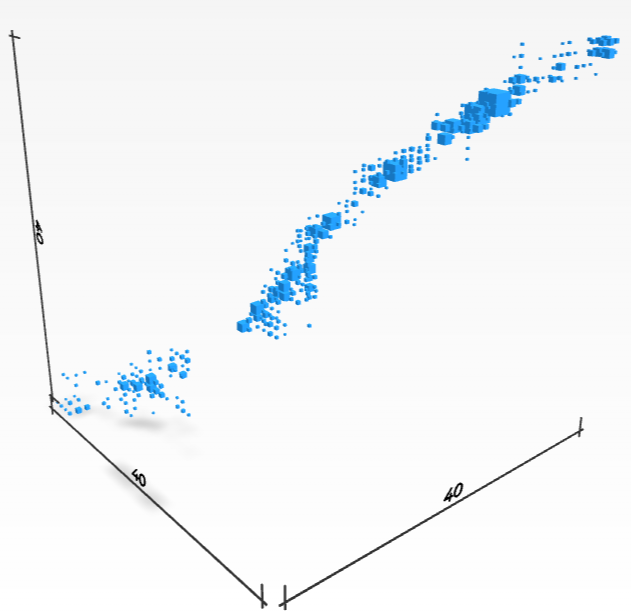
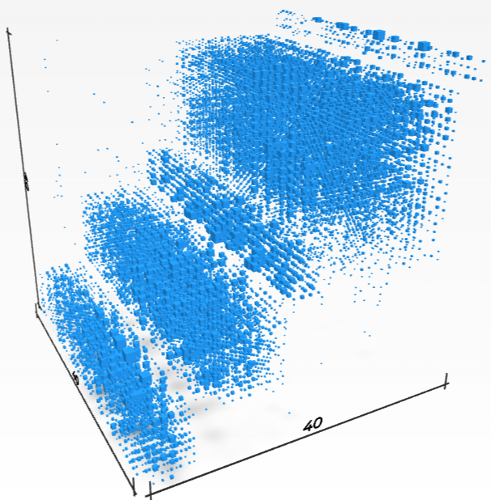

# TSJulia: TheTensor.Space Julia
Tensor Space Functionality for Julia Programming Platform.

[TheTensor.Space](https://TheTensor.Space/) is an open-source research project dedicated to studying the data types and algorithms for extracting information form high valence tables of numbers, what the sciences call a **tensor**.  The data comes in looking like this: 

Using the algebra of operators on tensors we recover oncover new frames of reference were the data reveals internal properties such as the following.

| [Strata](#strata) | [Channels](#channels) |
|---------------------|----------------|
| |  
|

| Diagonal Blocks | Step Blocks |
|------------------|----------------|
|   |  |

Our algorithms are provided in a number of platforms. 
  * The bleeding edge algorithms are developed and tested for [Magma Computer Algebra System](http://magma.maths.usyd.edu.au/magma/).  Core tensor algorithms are distributed with that system and you can follow [TheTensor.Space](https://TheTensor.Space/) for details on extensions and experimental additions.
  * Python access is available to core algorithms through [SageTensorSpace](https://github.com/thetensor-space/SageTensorSpace) for the [Sage Math](https://www.sagemath.org/) (in Python).
  * [Julia](https://julialang.org/) language port is being developed as [TSJulia](https://github.com/thetensor-space/TSJulia).

The algorithms presented in this tutorial are for instructional purposes.  For detailed treatments and improved performance follow the attached references.

## Our Team

We invite you explore the repository and join our team.  We welcome and encourage any contributions to the repository. If you need help getting started, please feel free to @-mention any of the contributors below or you can read the repository's [Projects](https://github.com/thetensor-space/TensorSpace/projects) tab.

|                                                                              | Name                | Username                         | Affiliation                |
-------------------------------------------------------------------------------|---------------------|----------------------------------|----------------------------|
      | Prof. Peter A. Brooksbank | [`@galois60`](https://github.com/galois60)                | Bucknell University |
  | Prof. Martin Kassabov     | [`@kassabov`](https://github.com/kassabov)        | Cornell University  |
      | Joshua Maglione, Ph.D. | [`@joshmaglione`](https://github.com/joshmaglione)                | Bucknell University |
       | Amaury V. Miniño    | [`@amaury-minino`](https://github.com/amaury-minino)                  | Colorado State University |
       | Prof. James B. Wilson     | [`@algeboy`](https://github.com/algeboy)                  | Colorado State University |

---

### Installing TSJulia.

 - Make sure to have a recent installation of the Julia Language, v. > 1.7.0 seems to compatabile with the features required for TSJulia.  If you do not have an installation of Julia follow the installation instructions for the Julia system available [here](https://julialang.org/).
 - Clone or Download the TSJulia release from github [here](https://github.com/thetensor-space/TSJulia).  Make sure `julia` can be run from whatever folder contains your `TSJulia` download, typically by ensuring that `julia` is in the path of your operating system shell.
 - From the command line start julia and load the `TSJulia` package by using `include("$path$/TSJulia/TSJulia.jl")`

---

### Strata

A tensor supported on a surface.

A random change of basis to the above tensor.

The result of reconstruction 

---

### Channels

---

### Blocks

### Steps

---

