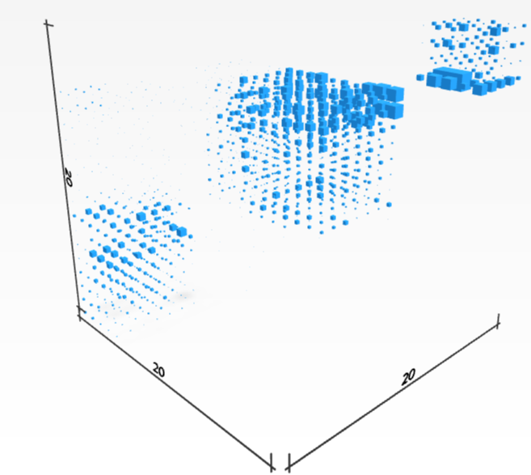

# TSJulia
Tensor Space Functionality for Julia Programming Platform.

## Welcome to TheTensor.Space Julia Port

| Stratification | Diagonal Blocks | Step Blocks |
|---------------------|------------------|----------------|
| |   |  |

TheTensor.Space is an open-source research project dedicated to studying the data types and algorithms for extracting information form high valence tables of numbers, what the sciences call a **tensor**.  Our algorithms are provided in a number of platforms including the Magma Computer Algebra System, Sage Math (in Python), and Julia.

The algorithms presented in this tutorial are for instructional pruposes.  For detailed treatments and improved performance follow the attached references.

---

### Installing TSJulia.

 - Make sure to have a recent installation of the Julia Language, v. > 1.7.0 seems to compatabile with the features required for TSJulia.  If you do not have an installation of Julia follow the installation instructions for the Julia system available [here](https://julialang.org/).
 - Clone or Download the TSJulia release from github [here](https://github.com/thetensor-space/TSJulia).  Make sure `julia` can be run from whatever folder contains your `TSJulia` download, typically by ensuring that `julia` is in the path of your operating system shell.
 - From the command line start julia and load the `TSJulia` package by using `include("$path$/TSJulia/TSJulia.jl")`

---

### Experiment 1: Stratification.

A tensor supported on a surface.

A random change of basis to the above tensor.

The result of reconstruction 

---

### Experiment 2: Simples Blocks

---

## Our Team

We invite you explore the repository and join our team.  We welcome and encourage any contributions to the repository. If you need help getting started, please feel free to @-mention any of the contributors below or you can read the repository's [Projects](https://github.com/thetensor-space/TensorSpace/projects) tab.

|                                                                              | Name                | Username                         | Affiliation                |
-------------------------------------------------------------------------------|---------------------|----------------------------------|----------------------------|
      | Prof. Peter A. Brooksbank | [`@galois60`](https://github.com/galois60)                | Bucknell University |
  | Prof. Martin Kassabov     | [`@kassabov`](https://github.com/kassabov)        | Cornell University  |
       | Amaury V. Miniño    | [`@amaury-minino`](https://github.com/amaury-minino)                  | Colorado State University |
       | Prof. James B. Wilson     | [`@algeboy`](https://github.com/algeboy)                  | Colorado State University |

## Installation and Usage

For details on installation and usage visit the package website at [https://TheTensor.Space/TSJulia](https://TheTensor.Space/TSJulia).

