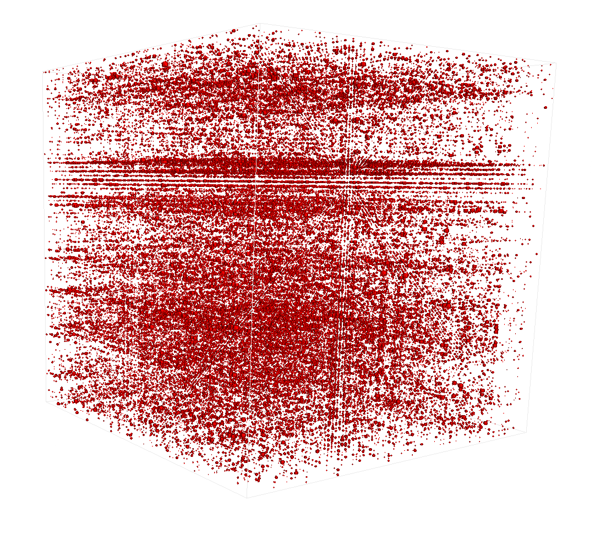
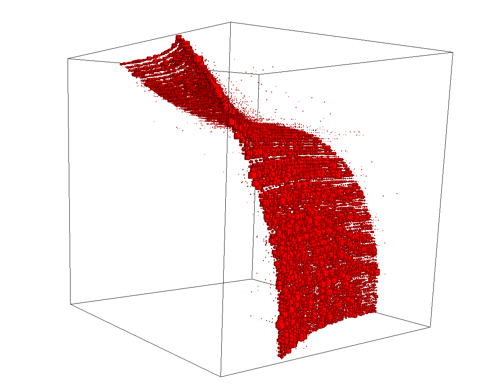
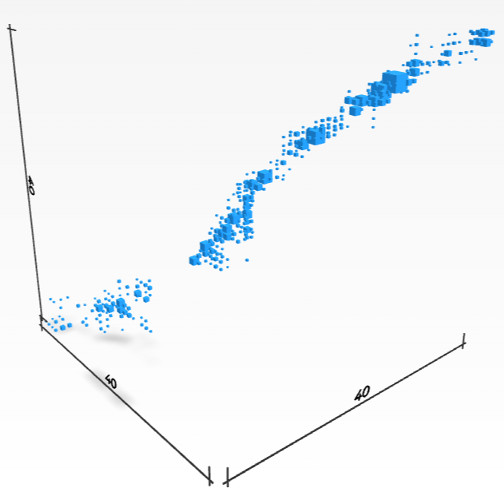
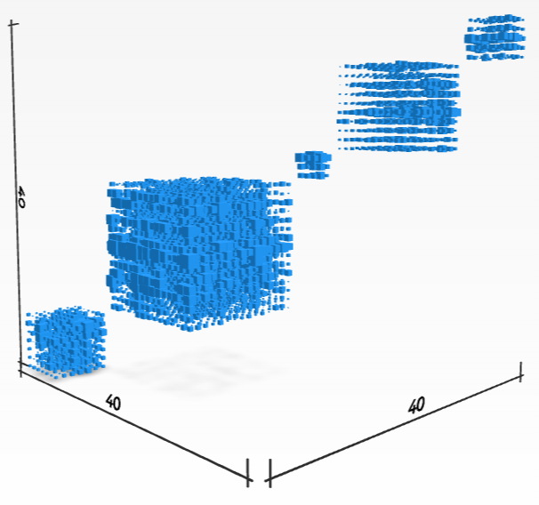
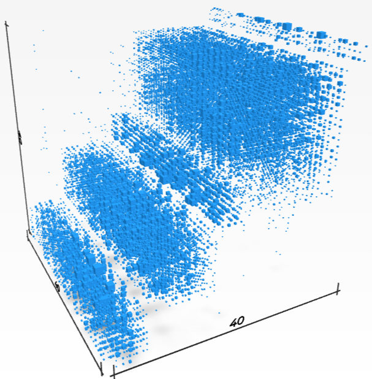
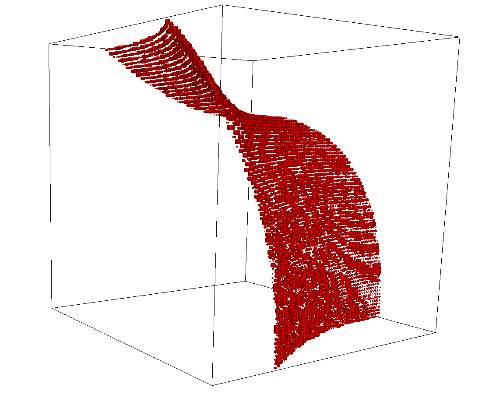

# OpenDleto <!-- omit from toc -->
Dleto, which means chisel, is a package of tools to detect and recover structure in tensor data. The allusion to chiseling comes from the control the package affords the user to choose the "shape" of the hidden structure they seek.
Visit  [TheTensor.Space](https://TheTensor.Space/) for more information about the main project.

In addition to giving access to the Julia source code for our implemetation, `OpenDleto` provides several Jupyter notebooks that showcase chiseling tools.
You can open Jupyter notebooks in your browser without installing anything simply by clicking on the **launch binder** buttons below. These notebooks allow you to explore the functionality of `OpenDleto` immediately with just a recent installation of Julia.


 - [](https://mybinder.org/v2/gh/thetensor-space/OpenDleto/HEAD?urlpath=%2Fdoc%2Ftree%2Flabs%2Fclusters%2FChiseling101.ipynb) The notebook [Chiseling101](labs/clusters/Chiseling101.ipynb) walks you through the basic functionality of the `OpenDleto` package. It shows how to set parameters to remove redunduncies, recover block decompositions, and detect continuous structures in tensor data.

 - [](https://mybinder.org/v2/gh/thetensor-space/OpenDleto/HEAD?urlpath=%2Fdoc%2Ftree%2Flabs%2Fgeometry%2FSphereLab.ipynb) The [Sphere Lab](labs/geometry/SphereLab.ipynb) shows how to recover a surface pattern&mdash;that could, say, be an artefact of a hidden fourier transform&mdash;underlying a seemingly random point cloud. To view just the results of the experiment, you can look at [static page](labs/geometry/SphereLab.html) or [PDF results](labs/geometry/SphereLab.pdf).


 - [](https://mybinder.org/v2/gh/thetensor-space/OpenDleto/HEAD?urlpath=%2Fdoc%2Ftree%2Fdata%2FWhatWeEatInAmerica.ipynb) The notebook [WhatWeEat](labs/geometry/WhatWeEatInAmerica.ipynb) shows how `OpenDleto` can be deployed on real data sets&mdash;in this case, nutrition data from a study called "What We Eat In America"&mdash;to extract 
 substantive information. 
 <!--
 - [](https://mybinder.org/v2/gh/thetensor-space/OpenDleto/HEAD?urlpath=%2Fdoc%2Ftree%2Flabs%2Fclusters%2FClusterLab.ipynb) The [Cluster Lab](labs/clusters/ClusterLab.ipynb) shows how to recover clusters in high-dimensional tensor data. 
 - [](https://mybinder.org/v2/gh/thetensor-space/OpenDleto/HEAD?urlpath=%2Fdoc%2Ftree%2Flabs%2Fhypergraphs%2FHypergraphLab.ipynb) The [Hypergraph Lab](labs/hypergraphs/HypergraphLab.ipynb) shows how you can also use the software to locate structure in hypergraphs.
 - [](https://mybinder.org/v2/gh/thetensor-space/OpenDleto/HEAD?urlpath=%2Fdoc%2Ftree%2Flabs%2Fdata%2FToyDataLab.ipynb) The [Toy Data Lab](labs/data/ToyDataLab.ipynb) uses the software on real data about toys to explore potential data science applications of Dleto.
-->


## Contents

<!--- [Contents](#contents)-->
- [What `OpenDleto` Does](#What-OpenDleto-Does)
- [Installation Guide](#Installation-Guide)
- [Our Team](#our-team)
- [Acknowledgments](#acknowledgments)
- [Samples](#samples)
  - [Strata](#strata)
- [Usage](#usage)
  - [Functions for Generating Stratified Tensors](#functions-for-generating-stratified-tensors)
  - [Functions for Stratifing Tensors](#functions-for-stratifing-tensors)

## What `OpenDleto` Does
Using the algebra of operators on tensors, Dleto methods change the coordinates of the modes of a given tensor to reveal hidden structure. This could manifest as a clustering of data into blocks, often revealing a lower valence support. For instance, given a 3-tensor represented as a point cloud 
<center>

</center>
`OpenDleto` can reveal that data clusters in 
any of the following ways:

| [Strata](#strata) | [Channels](#channels) |
|---------------------|----------------|
| |  
|


| Diagonal Blocks | Step Blocks |
|------------------|----------------|
|   |  |

## Installation Guide

Dleto is now a Julia package! You can install it in several ways:

### Option 1: From Local Directory (Development)

First clone or download this repository and then run:

```julia
using Pkg
Pkg.develop(path="/path/to/OpenDleto")
using Dleto
```

### Option 2: Direct from GitHub

```julia
using Pkg
Pkg.add(url="https://github.com/thetensor-space/OpenDleto")
using Dleto
```

### Option 3: For Development/Testing

To work on the package:

```julia
using Pkg
Pkg.activate(".")  # From OpenDleto directory
Pkg.instantiate()  # Install dependencies
using Dleto
```

### Requirements

 - Julia 1.7 or later
 - Dependencies (installed automatically):
   - `Arpack` - for fast SVD computations
   - `PlotlyJS` - for visualization
   - `LinearAlgebra`, `SparseArrays`, `Statistics`, `ProgressMeter`, `Random`

### Running Tests

To verify your installation:

```julia
using Pkg
Pkg.test("Dleto")
```

### Quick Start

```julia
using Dleto

# Create a random 3D tensor
t = randn(10, 10, 10)

# Transform to surface tensor
result = toSurfaceTensor(t)

# Access components
transformed_tensor = result.tensor
X_transform = result.Xchange
Y_transform = result.Ychange
Z_transform = result.Zchange
```

---

**Legacy Usage:** The old `include("Dleto.jl")` method still works if you include the file from the root directory, but using it as a package is now recommended.

---

## Our Team

We invite you explore the repository and join our team.  We welcome and encourage any contributions to the repository. If you need help getting started, please feel free to @-mention any of the contributors below or you can read the repository's [Projects](https://github.com/thetensor-space/TensorSpace/projects) tab.

|                                                                              | Name                | Username                         | Affiliation                |
-------------------------------------------------------------------------------|---------------------|----------------------------------|----------------------------|
      | Prof. Peter A. Brooksbank, Ph.D. | [`@galois60`](https://github.com/galois60)                | Bucknell University |
  | Prof. Martin Kassabov, Ph.D.     | [`@kassabov`](https://github.com/kassabov)        | Cornell University  |
      | Joshua Maglione, Ph.D. | [`@joshmaglione`](https://github.com/joshmaglione)                | University of Galway |
       | Amaury V. Miniño    | [`@amaury-minino`](https://github.com/amaury-minino)                  | Colorado State University |
       | Prof. James B. Wilson, Ph.D.     | [`@algeboy`](https://github.com/algeboy)                  | Colorado State University |

## Collaborators

Several other researchers have used `OpenDleto` tools and ideas to develop their own projects, including:
<ul>
<li>Clara Chaplin (Bucknell University), currently with Dell Technologies.</li>
<li>Gavin Moore (Bucknell University).</li>
</ul>


## Acknowledgments

The project has received partial support from the following granting organizations:

<!-- **Portions of the project sponsored by:** -->
 * The National Science Foundation (USA) to Peter A. Brooksbank (DMS-1620454), to Martin Kassabov (DMS-1620454) to James B. Wilson (DMS-1620454).
 * The Simons Foundation to Peter A. Brooksbank (281435) to Martin Kassabov, and to James B. Wilson (636189).
 * The National Security Agency Math Sciences Program to Peter A. Brooksbank (Grant Number H98230-11-1-0146) to James B. Wilson (Grant Number H98230-19-1-00).

We also acknowledge the institutes that hosted 
research on related projects over the years:

 * The Colorado State University
 * Kent State University
 * The University of Auckland
 * Bucknell University
 * University Bielefeld
 * Hausdorff Institute For Mathematics
 * Isaac Newton Institute (EPSRC Grant Number EP/R014604/1)
 

---

<!--

---

## Samples

### Strata

A tensor supported on a surface:


A random change of basis to the above tensor:


The reconstruction obtained by our algorithm: 


## Usage

### Functions for Generating Stratified Tensors

The functions `randomSurfaceTensor`, `randomFaceCurveTensor` and `randomCurveTensor` produce tensors supported near a surface/face-curve/curve.  The input to the these functions consists of 3 arrays that define the 
restriction; and a parameter cutoff that governs how thick the support is

The helper functions `testSurfaceTensor`, `testFaceCurveTensor` and `testCurveTensor` measure if a tensor is supported near a surface/facecurve/curve with the given equation.
The output is between 0 and 1, where 0 means that the tensor is exactly supported on restriction. These functions are not perfectly normalized: for many restrictions random tensors have values around 0.5. 

### Functions for Stratifing Tensors

The functions `toSurfaceTensor`, `toFaceCurveTensor` and `toCurveTensor` attempt to stratify a given tensor by making orthogonal transformations of the 3 coordinates spaces, producing a tensor with a restricted support. The input is a 3-dimensional array. There is a second (optional) argument, which is a function performing an SVD of a large system of linear equations.

The output is a named tuple with 7 components: `.tensor` is the transformed tensor; `.Xchange`, `.Ychange` and `.Zchange` are the 3 orthogonal matrices used to do the transformation; and `.Xes`, `.Yes` and `.Zes` are vectors that restrict the support. 

We recommend that these functions are applied only to non-degenerate tensors (i.e. tensors that cannot be shrunk using HoSVD). If the input tensor is degenerate, these functions are likely to discover the degeneracy and not find any additional structure.

The functions have not been tested on abstract arrays. If the input is a sparse tensor represented as some `AbstractArray`, it might be necessary to 
first convert it to a normal `Array`.   

-->