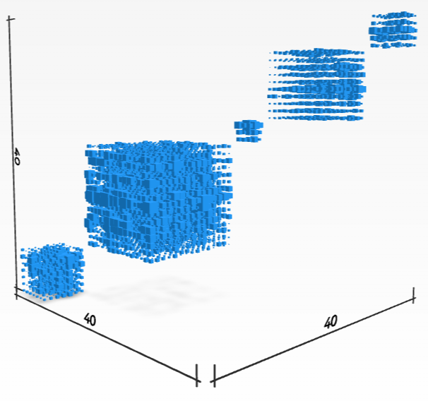

# OpenDleto <!-- omit from toc -->
Dleto, which means chisel, is a package of tools to carve information out of tensor data. 
If you want to try the notebooks in your browser without installing anything, click on the binder buttons: 
If you have a background in using Jupyter notebooks and have a recent installation of Julia you can get started.

 - [](https://mybinder.org/v2/gh/thetensor-space/OpenDleto/HEAD?urlpath=%2Fdoc%2Ftree%2Flabs%2Fgeometry%2FSphereLab.ipynb) [Sphere Lab](labs/geometry/SphereLab.ipynb) recovering an underlying pattern of a surface from a random point cloud, like a hidden Fourier Transform.  If you want to just read the results instead, try: [static page](labs/geometry/SphereLab.html) or [PDF results](labs/geometry/SphereLab.pdf)
 - [](https://mybinder.org/v2/gh/thetensor-space/OpenDleto/HEAD?urlpath=%2Fdoc%2Ftree%2Flabs%2Fclusters%2FClusterLab.ipynb) [Cluster Lab](labs/clusters/ClusterLab.ipynb) recovering clusters in high-dimensional data. 
 - [](https://mybinder.org/v2/gh/thetensor-space/OpenDleto/HEAD?urlpath=%2Fdoc%2Ftree%2Flabs%2Fhypergraphs%2FHypergraphLab.ipynb) [Hypergraph Lab](labs/hypergraphs/HypergraphLab.ipynb) locating structure in hypergraphs.
 - [](https://mybinder.org/v2/gh/thetensor-space/OpenDleto/HEAD?urlpath=%2Fdoc%2Ftree%2Flabs%2Fdata%2FToyDataLab.ipynb) [Toy data lab](labs/data/ToyDataLab.ipynb) use real data about toys to explore potential data science applications of Dleto.


Visit  [TheTensor.Space](https://TheTensor.Space/) for more information about the main project.


## Contents

- [Contents](#contents)
- [What can we find?](#what-can-we-find)
- [Install](#install)
- [Our Team](#our-team)
- [Acknowledgments](#acknowledgments)
- [Samples](#samples)
  - [Strata](#strata)
- [Usage](#usage)
  - [Functions for Generating Stratified Tensors](#functions-for-generating-stratified-tensors)
  - [Functions for Stratifing Tensors](#functions-for-stratifing-tensors)

## What can we find?
Using the algebra of operators on tensors, Dleto methods determine change of coordinates relative to which tensor data is supported on a smaller valence.  

For a 3-tensor represented as a point cloud 
<center>

</center>

this means a to cluster the data near a block array of 2-tensors. 

Here are some examples of what this can look like:

| [Strata](#strata) | [Channels](#channels) |
|---------------------|----------------|
| |  
|


| Diagonal Blocks | Step Blocks |
|------------------|----------------|
|   |  |


## Install

We have packaged the essentials into a single file `Delto.jl` having rudimentary but stand-alone implementations of some of the chiseling methods.  You may download that file alone, but you may also benefit from using the examples in `examples/..`.  Start with `examples/Demo.jl`.

 - A recent installation of the Julia Language is needed (ver. 1.7.0 or later seems to be compatible with the features required for `OpenDleto`).  If you do not have an installation of Julia, follow the installation instructions for the Julia system available [here](https://julialang.org/).
 - Clone or Download the `OpenDleto` release from github [here](https://github.com/thetensor-space/OpenDleto).  Make sure `julia` can be run from whatever folder contains your `OpenDleto` download, typically by ensuring that `julia` is in the path of your operating system shell.
 - From the command line start julia and load the `OpenDleto` package by using `include("$path$/OpenDleto/Dleto.jl")`
---
The functions mostly require standard Julia packages like `Random` and `LinearAlgebra`. The only other requirement is the package `Arpack` which will be installed automatically by the include command above. It is recommended that this package is manually installed; the following are commented out of `Dleto.jl` (lines 5 & 6):

```julia
julia> import Pkg
julia> Pkg.add("Arpack")
```

The code can be used without `Arpack` but it will run significantly 
more slowly. To do so, one must comment out the function `ArpackEigen` (lines 274-282) and change the default function from `ArpackEigen` to `LinearAlgebraEigen` in the function `toSurfaceTensor`, `toFaceCurveTensor` and `ToCurveTensor` (lines 358, 396  and 436)


Our algorithms are provided in a number of platforms.   
  * The bleeding edge algorithms are developed for, and tested in the [Magma] Computer Algebra System (http://magma.maths.usyd.edu.au/magma/).  Core tensor algorithms are distributed with that system. Further information about extensions and experimental additions can be found at [TheTensor.Space](https://TheTensor.Space/).
  * Python access is available to core algorithms through [SageTensorSpace](https://github.com/thetensor-space/SageTensorSpace) for the [Sage Math](https://www.sagemath.org/) (in Python).
  * [Julia](https://julialang.org/) language port is being developed as [OpenDelto](https://github.com/thetensor-space/OpenDleto).

The algorithms presented in this tutorial are for instructional purposes.  For detailed treatments and improved performance follow the attached references.

---

## Our Team

We invite you explore the repository and join our team.  We welcome and encourage any contributions to the repository. If you need help getting started, please feel free to @-mention any of the contributors below or you can read the repository's [Projects](https://github.com/thetensor-space/TensorSpace/projects) tab.

|                                                                              | Name                | Username                         | Affiliation                |
-------------------------------------------------------------------------------|---------------------|----------------------------------|----------------------------|
      | Prof. Peter A. Brooksbank, Ph.D. | [`@galois60`](https://github.com/galois60)                | Bucknell University |
  | Prof. Martin Kassabov, Ph.D.     | [`@kassabov`](https://github.com/kassabov)        | Cornell University  |
      | Joshua Maglione, Ph.D. | [`@joshmaglione`](https://github.com/joshmaglione)                | University of Galway |
       | Amaury V. Miniño    | [`@amaury-minino`](https://github.com/amaury-minino)                  | Colorado State University |
       | Prof. James B. Wilson, Ph.D.     | [`@algeboy`](https://github.com/algeboy)                  | Colorado State University |


## Acknowledgments

The project has received partial support from the following granting organizations:

**Portions of the project sponsored by:**
 * The National Science Foundation (USA) to Peter A. Brooksbank (DMS-1620454), to Martin Kassabov (DMS-1620454) to James B. Wilson (DMS-1620454).
 * The Simons Foundation to Peter A. Brooksbank (281435) to Martin Kassabov, and to James B. Wilson (636189).
 * The National Security Agency Math Sciences Program to Peter A. Brooksbank (Grant Number H98230-11-1-0146) to James B. Wilson (Grant Number H98230-19-1-00).

We also acknowledge the institutes that hosted 
research on related projects over the years:

 * The Colorado State University
 * Kent State University
 * The University of Auckland
 * Bucknell University
 * University Bielefeld
 * Hausdorff Institute For Mathematics
 * Isaac Newton Institute (EPSRC Grant Number EP/R014604/1)
 

---

---

## Samples

### Strata

A tensor supported on a surface:


A random change of basis to the above tensor:


The reconstruction obtained by our algorithm: 


## Usage

### Functions for Generating Stratified Tensors

The functions `randomSurfaceTensor`, `randomFaceCurveTensor` and `randomCurveTensor` produce tensors supported near a surface/face-curve/curve.  The input to the these functions consists of 3 arrays that define the 
restriction; and a parameter cutoff that governs how thick the support is

The helper functions `testSurfaceTensor`, `testFaceCurveTensor` and `testCurveTensor` measure if a tensor is supported near a surface/facecurve/curve with the given equation.
The output is between 0 and 1, where 0 means that the tensor is exactly supported on restriction. These functions are not perfectly normalized: for many restrictions random tensors have values around 0.5. 

### Functions for Stratifing Tensors

The functions `toSurfaceTensor`, `toFaceCurveTensor` and `toCurveTensor` attempt to stratify a given tensor by making orthogonal transformations of the 3 coordinates spaces, producing a tensor with a restricted support. The input is a 3-dimensional array. There is a second (optional) argument, which is a function performing an SVD of a large system of linear equations.

The output is a named tuple with 7 components: `.tensor` is the transformed tensor; `.Xchange`, `.Ychange` and `.Zchange` are the 3 orthogonal matrices used to do the transformation; and `.Xes`, `.Yes` and `.Zes` are vectors that restrict the support. 

We recommend that these functions are applied only to non-degenerate tensors (i.e. tensors that cannot be shrunk using HoSVD). If the input tensor is degenerate, these functions are likely to discover the degeneracy and not find any additional structure.

The functions have not been tested on abstract arrays. If the input is a sparse tensor represented as some `AbstractArray`, it might be necessary to 
first convert it to a normal `Array`.   
