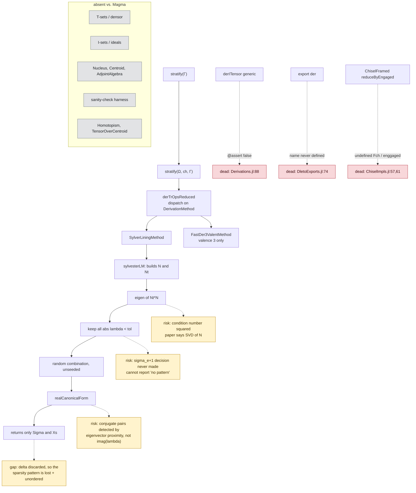
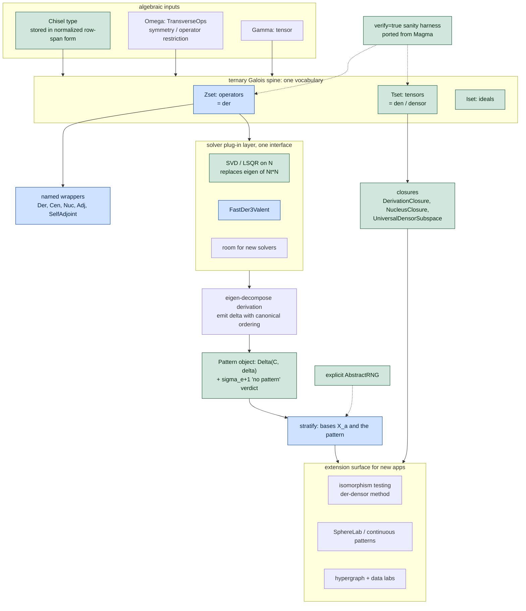

# OpenDleto vs. thetensor-space Magma packages — code review (IN PROGRESS)

Status: core read complete (`Dleto.jl`, `DletoBase.jl`, `Chisels.jl`, `chisels/ChiselImpls.jl`,
`Operators.jl`, `TransverseOperators.jl`, `Derivations.jl`, `Densors.jl`, `SylverLining`,
`DletoExports.jl`). NOT yet read: `ops/*`, `solvers/FastDer3Valent.jl` (full), `solvers/NullSolvers.jl`,
`util/*`, `ext/*`, `test/*`. Test suite was still running when this was written.

Magma reference clones: scratchpad/magma/{TensorSpace,Densor,Sylver,Stratacastor,Homotopism,MatrixAlgebras}

## 1. Package correspondence

| Magma | OpenDleto | Verdict |
|---|---|---|
| `Sylver/src/Invariants.m` — `DerivationAlgebra(t,A,k)`, `Centroid(t,A)`, `Nucleus(t,a,b)`, `SelfAdjointAlgebra`, `AdjointAlgebra`, `Left/Mid/RightNucleus` | `derITensor`/`derTrOps(Reduced)` + chisel matrix | Z-sets present, **more general** than Magma; but no named algebra constructors |
| `Densor/src/Densor.m` — `DerivationClosure`, `NucleusClosure`, `UniversalDensorSubspace` | `Densors.jl` = `stratify` only; `den` is an abstract stub that `@assert false` | **T-sets absent** |
| I-sets `I(S,Ω)` (annihilator ideals) | — | absent |
| `Sylver/src/OverCentroid.m` — `TensorOverCentroid` | — | absent |
| `TensorSpace` `TenCat` (`Repeats`, `Fused`), `ChangeTensorCategory` | partial: `ops/TransverseOpsSymmetries.jl` | no tensor-category object; fusion handled ad hoc |
| `TensorSpace/Tensor/Radicals.m` — `Radical`, `Coradical` | `util/Nondegenerate.jl` (`nondeg`) | partial |
| `Homotopism` package | — | absent |
| `__SANITY_CHECK` / `__OperatorSanityCheck` / `__BSanity` | — | **absent** (worst gap for a float port) |
| invariant caching (`t\`Derivations` checkpoint) | — | absent |

### As-found control flow

## 2. T/I/Z framing (the stated goal)

- **Z-sets** are the only leg implemented, spelled `derTrOpsReduced(method, Ω, P, Γ)`
  = `Z(Γ,P) ∩ Ω`. No `Z`-flavored naming, no `Ω`-as-ideal-parameter symmetry.
- **Chisels are untyped.** `UniversalChisel`/`TuckerChisel`/`AdjointChisel`/`CentroidChisel`
  all return bare `Matrix`. Consequences: no dispatch, no validation, no invariant that a
  chisel is stored in canonical row-span form, no `show`. `normalize_chisel` implements the
  §8.2 row-span/column-scaling equivalence but **no solver calls it**.
- **Design win to preserve:** Magma parametrizes by `(A, k)` — a combinatorial encoding that
  can only express 0/±1 patterns. OpenDleto's `m×ℓ` chisel matrix expresses arbitrary linear
  ideals, including the `C(a) = [1 0 1 a; 0 1 1 1]` families of null_patterns §8.3 that are
  provably inequivalent for `ℓ ≥ 4`. OpenDleto is ahead of the Magma model here.
- **T-sets missing** means the package named after the densor cannot compute a densor.

## 3. Defects (evidence-backed)

### Dead code / will error on call
1. `chisels/ChiselImpls.jl:57` — `Fch.frames[engaged]`, undefined var (`FCh`). Function is dead.
2. `chisels/ChiselImpls.jl:61` — `haskey(enggaged,i)`, undefined var. Function is dead.
3. `Derivations.jl:88` — `derITensor` generic opens with `@assert false`, and the unreachable
   body calls `derTrOpsReduced(Ω,P,Γ,tol,nd)` **positionally** against a keyword signature
   (`:137`) → `MethodError` even if reached.
4. `DletoExports.jl:74` — `export der`; **`der` is never defined anywhere in the package.**
   Slips through because `DletoExports.jl` is included before the definitions (`Dleto.jl:45`).
5. `den` is exported but only exists as an abstract stub that `@assert false`.
6. `chisels/ChiselImpls.jl:68-69` — the same assertion twice.

### Correctness risks
7. **`realCanonicalForm` conjugate-pair detection** (`DletoBase.jl:218-229`) decides that
   eigenvalue `i` is part of a complex pair by testing whether *eigenvector real parts of
   columns i and i-1 are close*: `sum((n[:,i]-n[:,i-1]).^2) > tol`. The mathematical test is
   `imag(λ_i) ≠ 0` with pairing by `λ_i = conj(λ_{i-1})`. Two near-parallel real eigenvectors
   are misclassified as a rotation block → wrong strata. It also writes `D[i,i-1]`/`D[i-1,i]`
   without confirming `i-1` is the partner.
8. **Normal equations instead of SVD.** null_patterns Alg. 2 line 3 says *compute the SVD of N*.
   `SylverLining` builds `sylvester = sylve ∘ ester` (i.e. `NᵗN`, `:199` marks it
   `issymmetric=true`) and calls `eigen` on it. Squaring `N` squares the condition number —
   half the significant digits, exactly where the paper's σ_{e+1} threshold decision lives.
   Use `svd`/LSQR on the rectangular map.
9. **σ_{e+1} test never performed.** The paper decides *whether Γ admits a pattern* by checking
   the `(e+1)`-st smallest singular value, `e = dim null(C)` (`§6.2`, `§7.1`: `e=2` for `C_uni`,
   `e=1` for `C_adj`). OpenDleto keeps every `|λ| < tol` including the `e` scalar derivations
   and never reports "Γ does not conform to any pattern for this chisel" (Alg. 2 line 4).
   `Densors.jl:46` only errors when *zero* derivations are found.
10. **`stratify` discards the sparsity pattern.** Alg. 2 line 6 returns `(X_a)` *and*
    `∆(C, δ)`. `Densors.jl:25` returns only `(Σ, Xs)`; the eigenvalues `δ` — which *are* the
    pattern — are computed inside `realCanonicalForm` and thrown away. No eigenvalue sorting
    either, so the canonical decreasing order of §4/§9.3 (Fig. 7B, Prop. 9.4) is not applied.
11. **Unseeded randomness.** `Densors.jl:52` `coefs = [randn() for _ in 1:n_ders]` uses the
    global RNG with no way to pass one → strata are not reproducible run to run. Blocks
    regression testing of labs.
12. `@assert` used for user-facing validation throughout (`TransverseOperators.jl` passim,
    `SylverLining.jl:123`). Assertions are disableable and read as internal invariants;
    Magma's `require` is a user error. Should be `ArgumentError`/`DimensionMismatch`.
13. Concrete `::Matrix` annotations (`Chisels.jl:50,60,75`) vs `::AbstractMatrix` at call sites
    → `MethodError` for views/adjoints/`Symmetric`. The file's own `:28` TODO says so.

### Hygiene
14. `src/SylverLining/SylverLininig.jl` — misspelled filename ("Lininig"), repeated in the docstring.
15. Root-level scratch tests `test_deriv_match.jl`, `test_derivations.jl`, `test_derivations_v2.jl`,
    plus `test/old-tests/` — untracked, unreferenced.
16. `.venv/` (Python) sitting in a Julia package root.
17. `Densors.jl` is the only source file with no license header.
18. `reduceByEngaged` returns a `Tuple{TransverseOps,LinearMap}` for `TransverseOps` but a bare
    `ChiselFramed` for chisels — same exported generic, two different contracts.
19. `src/I want you to read OpenDelto and fast-de.md` — a mis-saved prompt inside `src/`.

## 4. Recommended shape (for discussion)

Reading the diagram against the two-coder history: the **spine** and the **Chisel type** are what
the over-designer was reaching for but built as empty abstract placeholders; the **solver plug-in
layer** is what the incremental coder actually got working. The refactor keeps the working solver
path and gives it exactly one abstraction to plug into, rather than four.

1. `Chisel <: AbstractChisel` type wrapping the matrix, constructed in normalized row-span form;
   `UniversalChisel`/`Tucker`/`Adjoint`/`Centroid` become constructors returning it.
2. Restore the ternary vocabulary as three exported verbs over `(S, P, Ω)` —
   `Zset`/`der`, `Tset`/`den`, `Iset` — with chisels as the linear-`P` special case and
   `Der`/`Cen`/`Nuc`/`Adj` as thin named wrappers (matching Sylver's surface).
3. Implement T-sets (`DerivationClosure`/`UniversalDensorSubspace` equivalents) — currently the
   package's namesake operation is missing.
4. Swap `eigen(NᵗN)` for `svd(N)`; add the σ_{e+1} decision and return `∆(C,δ)` from `stratify`.
5. Port Magma's sanity-check harness as an opt-in `verify=true` (float port needs it more than
   the exact one did).
6. Thread an `AbstractRNG` through `stratify`.
