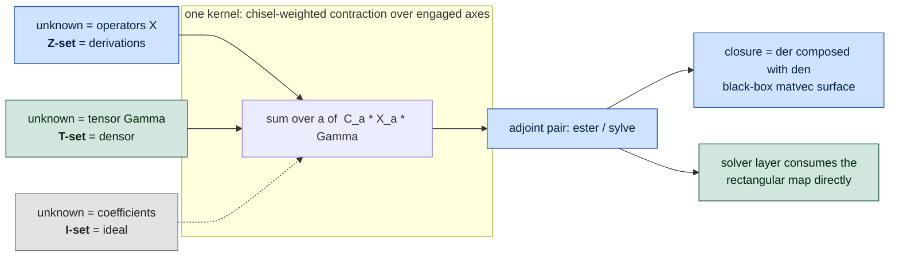
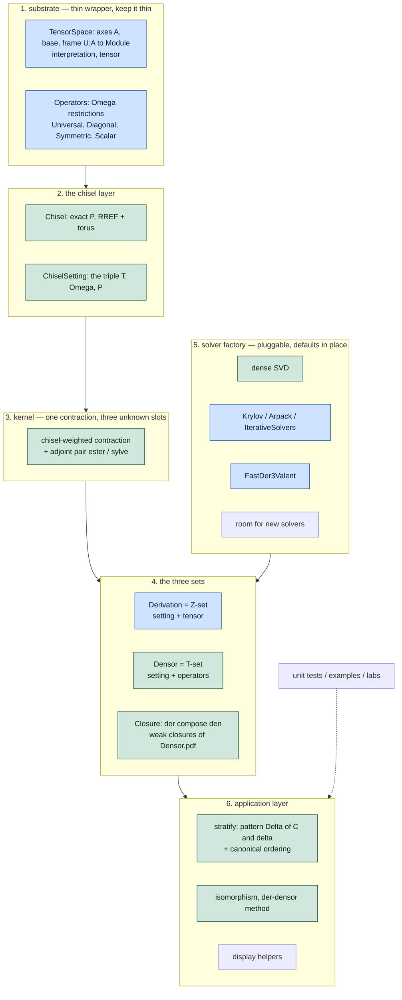

# OpenDleto refactor plan

Derived from [`docs/Dleto-Design.md`](../Dleto-Design.md) (author's design intent),
[`OpenDleto-vs-Magma.md`](OpenDleto-vs-Magma.md) (review findings) and the Magma siblings.
Written 2026-09-02. Nothing here has been implemented yet.

## 0. The organising idea

`Dleto-Design.md` states it directly: **T and Z are the same linear system with a different
unknown slot.** Trivalent form `XB + BY + B^Z = 0` — solve for `(X,Y,Z)` and you have a Z-set
(derivations); solve for `B` and you have a T-set (densor). Everything below follows from taking
that seriously: build **one contraction kernel** that knows the chisel-weighted sum, and let the
caller say which slot is unknown.

This is also why the densor is closer than it looks. `sylvesterLM` already constructs *both*
directions — `ester` maps operators to a tensor, `sylve` is its adjoint — and already returns a
`densor_map` that **nothing in the package consumes**. The missing piece is not the mathematics;
it is a kernel whose unknown slot is the tensor rather than the operators.



## 1. `Chisel` — the type, and how it is built

`Dleto-Design.md` used "chisel" two ways: the glossary says a chisel **is** `P`; the file layout
says it is `(𝕋, Ω, P)`. All decisions below are the author's, 2026-09-02.

**`Chisel` is the full setting `(𝕋, Ω, P)`.** A type wrapping `P` alone would just wrap a Julia
array and earn no new name. So `Derivation` needs a `Chisel` plus a tensor; `Densor` needs a
`Chisel` plus operators. `P` itself stays a plain `AbstractMatrix`.

**Convenience builders return a full `Chisel`**, filling the other two slots with the
*unrestricted* defaults — `𝕋` the full tensor space with no symmetry, `Ω` full square matrices
on every axis (today's `IndTransverseOps(frame, UniversalOp())`).

### 1.1 Chisels are keyed by `Index`, not by axis position

This is the load-bearing decision. A chisel names *which indices it engages*, with coefficients;
it says nothing about position or valence. The same chisel then applies to any future tensor
carrying those indices, whatever its valence and whatever order its axes come in.

```julia
UniversalChisel()             # engage every axis; valence read off the data later
UniversalChisel(i, j, k)      # engage exactly these indices
AdjointChisel(i, j)           # the {i,j} adjoint chisel
TuckerChisel(i)               # single-axis Tucker; TuckerChisel() = full Tucker
CentroidChisel()              # all axes; CentroidChisel(i, j, k) for a subset
Chisel(𝕋, Ω, P)               # explicit, fully specified
```

`UniversalChisel(3)` no longer needs the `3`. Rather than deprecate it outright, it is worth
keeping the integer form as a **valence assertion** — "universal, and the target must have
valence 3" — which leaves existing call sites working *and* gives them a meaning they did not
have before. That is strictly more useful than making it a no-op, and costs one `require`.

Note that an index-keyed chisel is still not a complete `Chisel`: knowing `{i,j}` does not give
you the rest of the frame, so `Ω` and `𝕋` still cannot be built. Every builder therefore returns
a **template** that completes itself when it meets data:

```julia
struct ChiselTemplate
    P::AbstractMatrix
    axes::Union{Nothing, Vector{Index}}   # nothing = "all axes of whatever arrives"
    policy::Symbol                        # representative policy, see §2
end

(t::ChiselTemplate)(Γ::ITensor) = Chisel(t, collect(inds(Γ)))
(t::ChiselTemplate)(frame::Vector{Index}) = Chisel(t, frame)
```

At application time the template checks that its named indices actually occur in the frame, and
expands `P` against the full frame — unnamed axes get zero columns, i.e. they are disengaged.

### 1.2 Why this is better than positional chisels

1. **It removes a whole class of silent error.** `AdjointChisel(valence, left, right)` today
   builds `±1` at *positions* `left` and `right`. If a tensor's axes arrive in a different order,
   or a lab relabels indices, the chisel quietly targets the wrong axes and returns a perfectly
   plausible wrong answer. Index-keyed chisels cannot do this; a missing index is an error at
   application time, with a name to report.
2. **Engagement stops being positional bookkeeping.** `engaged(P)::Vector{Bool}` and
   `reduceByEngaged` currently thread a position mask through the solvers. Engagement becomes
   "which indices does this chisel name" — an *ordered tuple* of indices, not a position mask.
   The order is not decoration: it fixes transpose placement (§1.3), so the engaged axes are a
   `Vector{Index}`, never a `Set`.
3. **It matches how ITensors already thinks.** Axes are `Index` objects, contraction is by index
   identity, not by slot. The chisel layer stops being the one place that reverts to positions.
4. **It completes what `ChiselFramed` was reaching for.** [`chisels/ChiselImpls.jl`](../../src/chisels/ChiselImpls.jl)
   already holds `frames::Vector{Index}` plus an `idx::Dict{Index,Integer}` map — a
   position↔index dictionary. That struct is the ancestor of this `Chisel`. Its two dead
   functions (the `Fch` / `enggaged` typos) should be **superseded, not merely deleted** as
   Phase 0 originally proposed; the concept was right, only unfinished.
5. **`TuckerChisel(i)` reproduces the paper's ladder for free.** `TuckerChisel()`,
   `TuckerChisel(i)`, `TuckerChisel(i,j)` are exactly the third / first / second Tucker chisels
   of `null_patterns.pdf` Prop. 8.1, without a separate constructor per case.
6. **Templates are reusable across tensors**, which is what the benchmark loops and the `labs/`
   κ(C) sweep want: build the chisel once, apply it to every tensor in a size sweep.
7. **No call-site churn.** `stratify(Γ)` becomes `UniversalChisel()(Γ)`, replacing the three
   lines of hand-assembly at [`Densors.jl:72-74`](../../src/Densors.jl#L72-L74) that are repeated
   across four `derITensor` methods in `Derivations.jl`. That duplication *is* the `Chisel` type
   written out longhand five times — good evidence the type is not new machinery but a name for
   something already present.

`stratify`, `der` and `den` should accept either a template or a full `Chisel` on one keyword:
apply the template to the tensor's frame, use the `Chisel` as-is.

### 1.3 The ordered pair fixes the transpose, not just a sign

I had this wrong earlier and the author corrected it. `AdjointChisel(i, j)` and
`AdjointChisel(j, i)` do generate the same ideal, so they cut out the same solution set — but the
order decides **which coordinate is transposed**, and that is what makes the result an *algebra*
rather than merely a subspace.

The argument, in the author's notation. Suppose `AM = MB` and `XM = MY`. Then

```
(XA)M = X(AM) = X(MB) = (XM)B = (MY)B = M(YB)
```

so first coordinates compose as `X·A` while second coordinates compose as `Y·B` — **the two
coordinates multiply in opposite orders.** A pointwise product `(a,b)·(a',b') = (aa', bb')`
therefore does not stay in the set. You get closure only by taking one coordinate in the opposite
ring, equivalently by storing it transposed, since transposition is an anti-isomorphism:
`(XA)ᵗ = AᵗXᵗ`.

**Convention (author): follow linear algebra — the transpose lives on the first coordinate.**

This is the same choice the Magma side makes explicitly: `Rihana.pdf` §1.2 sets
`Ω_ab = End(U_a)^op × End(U_b)` and notes "the opposite ring in the first equation ensures that
both types of nuclei are associative rings." `Sylver/src/Invariants.m` carries the bookkeeping in
`__A_Centroid` ("we want to return everything to `End(U_i)`, in particular no op — if `0 ∈ A`
then transpose"), in `__MakeAlgebra` ("if this is a nuke, then transpose might be required"), and
exposes it to users as `LeftNucleus(t : op := false)`.

**Implementation (author): track the transpose passively.** Solve for the same matrices — the
linear system is unchanged — then apply the transpose at the reporting boundary and inside any
product. So `Chisel` carries the convention, the solver stays transpose-agnostic, and only two
places know about it: the result constructor and the algebra product.

**This machinery already exists in the package, unnamed.** `TransverseOperators.jl` has
`embedITensors` alongside `embedITensorsSwapped` / `unsafe_embedITensorsSwapped`, plus
`__asMatrix` / `__asMatrixTranspose`, `transposeEmbed` and `dualize` — and the split is live:
`sylvesterLM` solves through `unsafe_embedITensorsSwapped`
([`SylverLining.jl:177,191`](../../src/SylverLining/SylverLininig.jl#L177)) while `stratify`
reports through plain `embedITensors` ([`Densors.jl:56`](../../src/Densors.jl#L56)). That is
"solve untransposed, report transposed" already in the code, with no docstring saying so and no
test pinning it. Phase 1 should **name and document this as the transpose convention and pin it
with tests**, not reinvent it — but it does need verifying against the stated convention first,
since nothing currently asserts which of the two embeddings is the reporting one.

## 2. `P` keeps any representative of the row span — conditioning is a real knob

**DECIDED (author, 2026-09-02):** do *not* force a single canonical form. RREF with integer
entries is the good form for reasoning and for how a user starts; but a well-conditioned
representative should be selectable, with better selection left as future work.

The reason is worth writing down because it is verifiable in the current code. `ester` pushes
into the chisel axis by contracting with column `C_a`, and `sylve` pulls back out by contracting
with `C_b` ([`SylverLining.jl:176-195`](../../src/SylverLining/SylverLininig.jl#L176-L195)). So
the composed operator carries `⟨C_a, C_b⟩` — the **Gram matrix of the chisel's columns, `CᵗC`** —
in the middle, and every iterative solver hits it repeatedly. A badly conditioned `C` therefore
degrades convergence multiplicatively, not once.

That also re-frames `normalize_chisel` ([`src/Chisels.jl:60`](../../src/Chisels.jl#L60)): its SVD
returns an orthonormal row basis, i.e. **the representative with condition number 1**. It was not
the wrong idea — it is the conditioning-optimal choice. Its only defects are that nothing calls
it and there is no way to ask for a different policy.

Plan: `Chisel` stores `P` together with a representative policy, and *identity is the row span*
(equality and hashing compare row spans, not matrices):

| policy | form | for |
|---|---|---|
| `:rref` | exact RREF, integer where possible | reasoning, teaching, exact backends |
| `:orthonormal` | SVD row basis, `κ = 1` | default for iterative solvers |
| `:torus` | column-equilibrated by a diagonal | the design doc's torus rescaling; directly targets `CᵗC` |
| future | conditioning-aware selection | the open question worth experimenting on |

Worth an experiment before committing: sweep `κ(C)` against iteration counts on a fixed tensor to
confirm the effect size. That measurement belongs in `labs/`.

## 3. Target module layout

Follows your guessed layout, with the two-coder balance called out per layer.



**Where each coder was right.** The operator-encoding layer (layer 1) is the over-designer's work
and it is the best-tested code in the package — 2430 passing assertions. Keep it, stop expanding
it. The solver path (layer 5) is the incremental coder's and it actually runs. Keep it, give it
one interface instead of ad-hoc `Symbol` dispatch. The abstraction that was *missing* from both is
layer 3 — and its absence is why `den` was left as an `@assert false` stub for the over-designer to
fill in and the incremental coder never needed.

## 4. Two axes of choice, currently conflated

`method` (which formulation) and `solver` (which linear algebra) are independent, but today
`SylverLiningMethod` and `FastDer3ValentMethod` each carry their own `solver::Symbol` field and
`get_derivation_method` switches on a hard-coded `if/elseif`.

Plan: `solve(problem::ChiselProblem, formulation, backend)` where formulation ∈ {Sylvester,
FastDer3Valent, …} and backend ∈ {DenseSVD, Krylov, Arpack, LSQR, …}, both with defaults and both
extensible by registration rather than by editing a factory function. The existing `ext/`
extensions already suggest this shape; they just have no interface to plug into.

### 4.1 Incorporating `../fast-der-solver`

That repo (Chris Liu's, with a 2025 grad-show poster) holds **two** algorithms, not one, and both
belong in the factory as formulations:

| Algorithm | Reference file | Shape | Status here |
|---|---|---|---|
| quick-der | `quick-der-lib.jl` | triple restriction `(a',b',c')`, solve small dense system, lift by three affine solves | ported as `FastDer3Valent`, with defects (below) |
| quicksylver | `quicksylver-lib.jl` | double restriction `(a',b')`, affine *frame* rather than nullspace basis | **not ported** — matches the `[COMING SOON] QuickSylver` stub in `NullSolvers.jl` |

The shared idea is the same and it is a genuine asymptotic win, not a constant factor: solve the
derivation system only on a small `(a',b',c')` corner, then lift to the full frame by solving
small affine systems (`N_C`, `N_R`, `N_D` against `linear_equals_affine`). `select_restriction_sizes`
balances the block at `ceil(sqrt(3·max(r,s,t)³))` and refuses sizes that would make the restricted
system rank-deficient.

**Evidence** (`quicksylver-vs-dleto-results.csv`, the author's own benchmark): at a comparable
wall clock of roughly six minutes, solve-and-lift reached `n = 315`, the current OpenDleto path
reached `n ≈ 68`, and the dense baseline `n ≈ 33`. Worth having.

**Defects in the existing port**, both to fix as part of incorporation:

1. **Sign convention bug — wrong chisel.** [`FastDer3Valent.jl:376-379`](../../src/solvers/FastDer3Valent.jl#L376-L379)
   sets `R = c₁Γ, S = c₂Γ, T = c₃Γ`, but the reference solves `X·R + S·Y − T·Z = 0`
   (`quick-der-lib.jl:68`) — the third slot enters *negated*. So a chisel `[c₁,c₂,c₃]` is solved
   as `[c₁,c₂,−c₃]`. With the default `UniversalChisel(3)` = `[1,1,1]` the solver actually
   computes derivations for `[1,1,−1]` — a different Z-set, hence different strata, from
   `:SylverLining` on the same input. Fix: negate the third slot (`T = -c₃*Γ`), and add a
   regression test that the two methods return the *same* derivation space, not merely
   same-shaped output.
2. **Verification silently dropped.** The reference's `derivation_solver` always runs
   `check_derivation_solution` and errors `"Retry with larger a',b',c'!"` on failure — necessary,
   because solve-and-lift is only *generically* correct at a given `(a',b',c')`. In the port,
   `faster_randomized_check` is stored in the struct, threaded to `_fastder_solve_basis`
   ([`:323`](../../src/solvers/FastDer3Valent.jl#L323), [`:386`](../../src/solvers/FastDer3Valent.jl#L386))
   — and **never used**; no check function exists. A detectable failure became a silent wrong
   answer. The restriction-size guard did survive ([`:121-123`](../../src/solvers/FastDer3Valent.jl#L121-L123)).

**Incorporation notes.** The reference libs carry module-level `TimerOutput` globals
(`to`, `sylver_to`) and `@timeit` annotations; those must not come across as package state —
either drop them or put timing behind the solver interface. `linear-algebra-lib.jl`
(`lin_solve`, `linear_equals_affine`) is small and shared by both algorithms, so it belongs in the
kernel/solver support layer once, not copied per solver. Both algorithms are hard-wired to
valence 3 and to one-row fully-engaged chisels; that restriction is fine and should be declared
by the formulation, then enforced by the factory rather than by hand-rolled `error()` calls.

## 5. Numerics

- Keep the composed operator `NᵗN` — it is your closure object and the only surface an
  iterative eigensolver can use. **But stop extracting nullspaces through it.** For the
  decision and the basis, run `svd`/LSQR against the rectangular `ester` map, per Algorithm 2.
- Implement the **σ_{e+1} test**: `e = dim null(C)`, and report "Γ admits no pattern for this
  chisel" rather than only failing when zero derivations turn up.
- Return `δ` from `stratify` — `∆(C, δ)` *is* the answer — and apply the canonical decreasing
  ordering of §4 / Prop. 9.4.
- Replace the eigenvector-proximity conjugate-pair heuristic in `realCanonicalForm` with a test
  on `imag(λ)` and pairing by conjugacy.
- Thread an `AbstractRNG` through `stratify`.

### 5.1 `stratify` returns a `Stratification`

**DECIDED (author, 2026-09-02):** return a type, not a `NamedTuple`, so it can grow fields later
without breaking callers again.

```julia
struct Stratification
    Σ                    # the stratified tensor
    Xs                   # the per-axis transforms
    δ                    # the eigenvalue spectrum per axis — the pattern data
    pattern              # Δ(C, δ): which blocks may be nonzero
    verdict              # σ_{e+1} outcome: does Γ admit a pattern for this chisel?
    chisel::Chisel       # provenance: what produced this
end
```

Carrying the `chisel` is deliberate. Magma attaches provenance to every derived object —
`DerivedFrom(~Operators, t, A, A_rep : Fused := F)` in `Sylver/src/Invariants.m`, and
`Delta_Lie`'s `DerivedFrom` is what `Densor.m` reads back to recover the tensor category. A
`Stratification` that cannot say which chisel produced it loses the same information.

**Migration is cheaper than it looks**, because field access is unchanged: `res.Σ` and `res.Xs`
keep working, so the labs and `TestFastDer3Valent.jl` (which uses `fast.Σ`, `fast.Xs`) need no
edit. Two things do need attention:

1. **Positional destructuring breaks.** [`Densors.jl:58`](../../src/Densors.jl#L58) does
   `Δ, Xs = stratify(Γ, δ)`, which iterates the `NamedTuple`. A plain struct is not iterable.
   Either define `Base.iterate` on `Stratification` for the two legacy fields, or switch such
   sites to named destructuring `(; Σ, Xs) = stratify(...)`, which works on any struct. Prefer
   the latter internally and provide `Base.iterate` only if labs need it.
2. **The two-argument `stratify(Γ, der)`** returns the same shape today. It should either return
   a `Stratification` with `δ`/`pattern`/`verdict` marked unavailable, or be renamed to something
   that does not promise a full stratification — it applies a *given* derivation rather than
   finding one, so it cannot supply a σ_{e+1} verdict.

## 6. Extension points to build in deliberately

Each of these is a seam the current code lacks, and each maps to something already on your TBD list:

1. **New solver** — register a backend; no core edit.
2. **New chisel family** — construct a `Chisel`; the `(A,k)` families of Magma and the
   `C(a)` families of §8.3 are both just matrices.
3. **New operator restriction Ω** — symmetric, orthogonal, unitary, group-fixed points
   (`Densor.pdf` §8.4 `Der_Ω`).
4. **Dual / covariant axes** — your TBD. Reserve it as a partition on `A` in the frame type now,
   even if unused, so adding it later is not a breaking change.
5. **`U → hom(V,W)` interpretations** — your TBD. This is why `interpretation` should be its own
   field rather than implied by the array shape.
6. **Exact arithmetic backend** — keep the substrate behind layer 1 so ITensors is swappable.

## 7. Phasing

Each phase ends with the suite green, so there is always a working package.

```mermaid
flowchart LR
  P0["Phase 0<br/>green baseline"] --> P1["Phase 1<br/>Chisel type"]
  P1 --> P2["Phase 2<br/>kernel + adjoint pair"]
  P2 --> P3["Phase 3<br/>Densor / T-sets"]
  P3 --> P4["Phase 4<br/>solver factory"]
  P4 --> P5["Phase 5<br/>numerics + pattern"]
  P5 --> P6["Phase 6<br/>closures, named wrappers"]
  P6 --> P7["Phase 7<br/>I-sets, apps"]

  classDef small fill:#d1e7dd,stroke:#0f5132,color:#04250f
  classDef big fill:#fff3cd,stroke:#b8860b,color:#3d2c00
  class P0,P1,P4 small
  class P2,P3,P5,P6,P7 big
```



- **Phase 0 — green baseline.** Add `Random` to `[extras]`/`[targets]`; drop the three weakdeps
  with no extension; re-enable `TestSylverLining.jl`; delete the dead `Fch`/`enggaged` functions
  and the `export der`; remove root-level scratch tests, `test/old-tests/`, the stray prompt file
  in `src/`, and the Python `.venv`; fix the `SylverLininig.jl` spelling. No behaviour change.
- **Phase 1 — `Chisel`.** Exact RREF type plus constructors; keep `AbstractMatrix` accepted at
  public entry points so existing labs keep working.
- **Phase 2 — kernel.** Extract the chisel-weighted contraction and the `ester`/`sylve` adjoint
  pair out of `SylverLining` into the kernel layer, with the unknown slot as a parameter.
  Existing derivation results must be unchanged — this is the phase to pin with regression tests.
- **Phase 3 — `Densor`. The priority (author, 2026-09-02): fill this gap first.** Implement `den`
  against the kernel with the tensor as unknown slot.
  - **Do not inherit the normal-equations pattern.** Phase 5 fixes the existing Z-path, but the
    T-path is new code — extract its nullspace from the rectangular map with SVD/LSQR from the
    start. Otherwise Phase 5 has to fix the same flaw twice.
  - Validation: Magma cross-checking is deferred (§8 item 2), so this phase leans on internal
    consistency — sample `s` from the computed T-set and assert `Δ ⊆ Der(s)`, which is exactly
    Magma's own `__SANITY_CHECK` in `Densor.m`
    (`assert forall{i : i in [1..10] | Delta subset DerivationAlgebra(Random(S))}`). Note the
    limitation: a self-check cannot catch a misconception shared by the T-side and the Z-side,
    since both go through the same kernel. The Magma comparison remains the thing that would.
  - Targets to reproduce eventually: `DerivationClosure`, `UniversalDensorSubspace`, and the
    rank-1 densor example shipped in the Magma `Densor/examples/`.
- **Phase 4 — solver factory.** Registration-based; fold the two `solver::Symbol` fields into it.
- **Phase 5 — numerics.** SVD/LSQR extraction, σ_{e+1} verdict, return `δ`, ordering, RNG,
  `realCanonicalForm` fix.
- **Phase 6 — closures and named wrappers.** `Der`, `Cen`, `Nuc`, `Adj`, `SelfAdjoint` as thin
  wrappers over `ChiselSetting`, matching Sylver's public surface; port Magma's sanity-check
  harness as opt-in `verify=true`.
- **Phase 7 — I-sets and applications.** Ideals; then the der-densor isomorphism method.

## 8. Open questions for you

1. ~~The `Chisel` vs `ChiselSetting` naming ruling.~~ **RESOLVED 2026-09-02** — see §1: `Chisel`
   is the full `(𝕋, Ω, P)`; builders curry and are keyed by `Index`; transpose on the first
   coordinate, tracked passively.
2. **DEFERRED 2026-09-02** — how to validate Phase 3 against Magma (by hand, or from existing
   reference outputs). Revisit when Phase 3 starts; until then the densor gets validated against
   internal consistency only (`Δ ⊆ Der(s)` for sampled `s`, and the `stratify` round trip).
3. ~~`NamedTuple` or `Stratification` type from `stratify`?~~ **RESOLVED 2026-09-02** — return a
   `Stratification` type, so fields can be added later without breaking callers again. See §5.1.
4. ~~Phase 3 (densor) or Phase 5 (numerics) first?~~ **RESOLVED 2026-09-02** — **fill the densor
   gap first.** This confirms the order already in §7 (0→1→2→3→…), so no rescheduling; see the
   Phase 3 note about not inheriting the normal-equations pattern.

All four settled. The plan is ready to execute from Phase 0.
